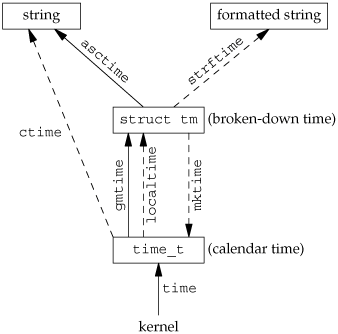
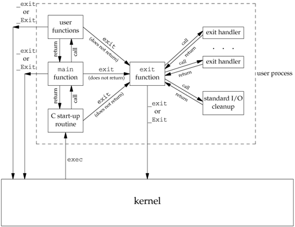
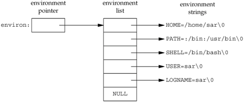
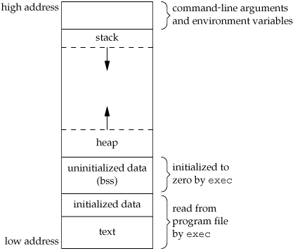
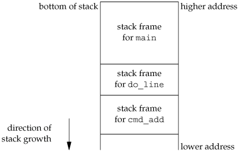

# Figures in APUE

## Chapter 1. UNIX System Overview

### 1.2 UNIX Architecture
In a strict sense, an operating system can be defined as the software that controls the hardware resources of the computer and provides an environment under which programs can run. Generally, we call this software the kernel, since it is relatively small and resides at the core of the environment. Figure 1.1 shows a diagram of the UNIX System architecture.


### 1.4 Files and Directories
File System
The UNIX file system is a hierarchical arrangement of directories and files. Everything starts in the directory called root, whose name is the single character /. A directory is a file that contains directory entries. Logically, we can think of each directory entry as containing a filename along with a structure of information describing the attributes of the file.

Filename
The names in a directory are called filenames. The only two characters that cannot appear in a filename are the slash character (/) and the null character.
Indeed, for portability, POSIX.1 recommends restricting filenames to consist of the following characters: letters (a-z, A-Z), numbers (0-9), period (.), dash (-), and underscore ( _ ).

Working Directory
Every process has a working directory, sometimes called the current working directory.
This is the directory from which all relative pathnames are interpreted. A process can change its working directory with the chdir function.

### 1.5 Input and Output
File Descriptors
File descriptors are normally **small non-negative integers** that the kernel uses to identify the files accessed by a process. Whenever it opens an existing file or creates a new file, the kernel returns a file descriptor that we use when we want to read or write the file.


### 1.6 Programs and Processes
Program
A program is an executable file residing on disk in a directory. A program is read into memory and is executed by the kernel as a result of one of the seven exec functions. We’ll cover these functions in Section 8.10.

### 1.7 Error Handling
When an error occurs in one of the UNIX System functions, a negative value is often returned, and the integer errno is usually set to a value that tells why. For example, the open function returns either a non-negative file  descriptor if all is OK or −1 if an error occurs. An error from open has about 15 possible errno values, such as file doesn’t exist, permission problem, and so on. Some functions use a convention other than returning a negative value. For example, most functions that return a pointer to an object return a null pointer to indicate an error.


The perror function produces an error message on the standard error, based on the current value of errno, and returns.
```c
#include <stdio.h>
void perror(const char *msg);
```

It outputs the string pointed to by msg, followed by a colon and a space, followed by the error message corresponding to the value of errno, followed by a newline.


### 1.10  Time Values


Historically, UNIX systems have maintained two different time values:

1. Calendar time. This value counts the number of seconds since the Epoch: 00:00:00 January 1, 1970, Coordinated Universal Time (UTC). (Older manuals refer to UTC as Greenwich Mean Time.) These time values are used to record the time when a file was last modified, for example.
The primitive system data type time_t holds these time values.

2. Process time. This is also called CPU time and measures the central processor resources used by a process. Process time is measured in clock ticks, which have historically been 50, 60, or 100 ticks per second.
The primitive system data type clock_t holds these time values. (We’ll show how to obtain the number of clock ticks per second with the sysconf function in Section 2.5.4.)

When we measure the execution time of a process, as in Section 3.9, we’ll see that the UNIX System maintains three values for a process:
- Clock time
- User CPU time
- System CPU time


## Chapter 4. Files and Directories

#### Figure 4.2. IPC type macros in <sys/stat.h>
Macro Type of object
S_TYPEISMQ() message queue
S_TYPEISSEM() semaphore
S_TYPEISSHM() shared memory object


#### Figure 4.6. The nine file access permission bits, from <sys/stat.h>

| st_mode mask | Meaning       |
| ------------ | ------------- |
| S_IRUSR      | user-read     |
| S_IWUSR      | user-write    |
| S_IXUSR      | user-execute  |
| S_IRGRP      | group-read    |
| S_IWGRP      | group-write   |
| S_IXGRP      | group-execute |
| S_IROTH      | other-read    |
| S_IWOTH      | other-write   |
| S_IXOTH      | other-execute |


#### Figure 4.10. The umask file access permission bits

| Mask bit | Meaning       |
| -------- | ------------- |
| 0400     | user-read     |
| 0200     | user-write    |
| 0100     | user-execute  |
| 0040     | group-read    |
| 0020     | group-write   |
| 0010     | group-execute |
| 0004     | other-read    |
| 0002     | other-write   |
| 0001     | other-execute |


| mode    | Description                               |
| ------- | ----------------------------------------- |
| S_ISUID | set-user-ID on execution                  |
| S_ISGID | set-group-ID on execution                 |
| S_ISVTX | saved-text (sticky bit)                   |
| S_IRWXU | read, write, and execute by user (owner)  |
| S_IRUSR | read by user (owner)                      |
| S_IWUSR | write by user (owner)                     |
| S_IXUSR | execute by user (owner)                   |
| S_IRWXG | read, write, and execute by group         |
|         |                                           |
| S_IRGRP | read by group                             |
| S_IWGRP | write by group                            |
| S_IXGRP | execute by group                          |
| S_IRWXO | read, write, and execute by other (world) |
|         |                                           |
| S_IROTH | read by other (world)                     |
| S_IWOTH | write by other (world)                    |
| S_IXOTH | execute by other (world)                  |


#### Figure 4.17. Treatment of symbolic links by various functions

| Function | Does not follow symbolic link | Follows symbolic link |
| -------- | ----------------------------- | --------------------- |
| access   |                               | •                     |
| chdir    |                               | •                     |
| chmod    |                               | •                     |
| chown    | •                             | •                     |
| creat    |                               | •                     |
| exec     |                               | •                     |
| lchown   | •                             |                       |
| link     |                               | •                     |
| lstat    | •                             |                       |
| open     |                               | •                     |
| opendir  |                               | •                     |
| pathconf |                               | •                     |
| readlink | •                             |                       |
| remove   | •                             |                       |
| rename   | •                             |                       |
| stat     |                               | •                     |
| truncate |                               | •                     |
| unlink   | •                             |                       |


Figure 6.1. Fields in /etc/passwd file

Figure 6.3. Fields in /etc/shadow file
Figure 6.4. Fields in /etc/group file

Figure 6.5. Account implementation differences

Figure 6.7. System identification name limits

#### Figure 6.6. Similar routines for accessing system data files

| Description | Data file      | Header     | Structure | Additional keyed lookup functions |
| ----------- | -------------- | ---------- | --------- | --------------------------------- |
| passwords   | /etc/passwd    | <pwd.h>    | passwd    | getpwnam , getpwuid               |
| groups      | /etc/group     | <grp.h>    | group     | getgrnam , getgrgid               |
| shadow      | /etc/shadow    | <shadow.h> | spwd      | getspnam                          |
| hosts       | /etc/hosts     | <netdb.h>  | hostent   | gethostbyname , gethostbyaddr     |
| networks    | /etc/networks  | <netdb.h>  | netent    | getnetbyname , getnetbyaddr       |
| protocols   | /etc/protocols | <netdb.h>  | protoent  | getprotobyname , getprotobynumber |
| services    | /etc/services  | <netdb.h>  | servent   | getservbyname , getservbyport     |


#### Figure 6.8 Relationship of the various time functions




Figure 6.9. Conversion specifiers for strftime


## Chapter 7. Process Environment

Before looking at the process control primitives in the next chapter, we need to examine the environment of a single process. 
In this chapter, we'll see how the main function is called when the program is executed, 

- how command-line arguments are passed to the new program, 
- what the typical memory layout looks like, 
- how to allocate additional memory, 
- how the process can use environment variables, and various ways for the process to terminate. 
- Additionally, we'll look at the longjmp and setjmp functions and their interaction with the stack. We finish the chapter by examining the resource limits of a process.

There are eight ways for a process to terminate. Normal termination occurs in five ways:
1. Return from main
2. Calling exit
3. Calling _exit or _Exit
4. Return of the last thread from its start routine (Section 11.5)
5. Calling pthread_exit (Section 11.5) from the last thread
Abnormal termination occurs in three ways:
6. Calling abort (Section 10.17)
7. Receipt of a signal (Section 10.2)
8. Response of the last thread to a cancellation request (Sections 11.5 and 12.7)


#### Figure 7.2. How a C program is started and how it terminates



#### Figure 7.5. Environment consisting of five C character strings



Historically, a C program has been composed of the following pieces:
- **Text segment**, the machine instructions that the CPU executes. Usually, the text segment is sharable so that only a single copy needs to be in memory for frequently executed programs, such as text editors, the C compiler, the shells, and so on. Also, the text segment is often read-only, to prevent a program from accidentally modifying its instructions.

- **Initialized data segment**, usually called simply the data segment, containing variables that are specifically initialized in the program. For example, the C declaration
int maxcount = 99;
appearing outside any function causes this variable to be stored in the initialized data segment with its initial value.

- **Uninitialized data segment**, often called the "bss" segment, named after an ancient assembler operator that stood for "block started by symbol." Data in this segment is initialized by the kernel to arithmetic 0 or null pointers before the program starts executing. The C declaration
long sum[1000];
appearing outside any function causes this variable to be stored in the uninitialized data segment.


- **Stack**, where automatic variables are stored, along with information that is saved each time a function is called. Each time a function is called, the address of where to return to and certain information about the caller's environment, such as some of the machine registers, are saved on the stack. The newly called function then allocates room on the stack for its automatic and temporary variables. This is how recursive functions in C can work. Each time a recursive function calls itself, a new stack frame is used, so one set of variables doesn't interfere with the variables from another instance of the function.

- **Heap**, where dynamic memory allocation usually takes place. Historically, the heap has been located between the uninitialized data and the stack.

#### Figure 7.6. Typical memory arrangement



## 7.7. Shared Libraries
Most UNIX systems today support shared libraries. Arnold [1986] describes an early implementation under System V, and Gingell et al. [1987] describe a different implementation under SunOS. Shared libraries remove the common library routines from the executable file, instead maintaining a single copy of the library routine somewhere in memory that all processes reference. This reduces the size of each executable file but may add some runtime overhead, either when the program is first executed or the first time each shared library function is called. Another advantage of shared libraries is that library functions can be replaced with new versions without having to relink edit every program that uses the library. (This assumes that the number and type of arguments haven't changed.)

Different systems provide different ways for a program to say that it wants to use or not use the shared libraries. Options for the cc (1) and ld (1) commands are typical. As an example of the size differences, the following executable filethe classic hello.c programwas first
created without shared libraries:

```shell
$ gcc -static hello1.c
$ ls -l a.out
-rwxr-xr-x 1 Trojan Trojan 877148 Dec 23 15:39 a.out
$ file a.out
a.out: ELF 64-bit LSB  executable, x86-64, version 1 (GNU/Linux), statically linked, for GNU/Linux 2.6.24, BuildID[sha1]=28131fc347999c685700cb6350859baf5f7b460e, not stripped
$ ./a.out
hello, world
$ size a.out
   text    data     bss     dec     hex filename
 782035    7532    9600  799167   c31bf a.out

$ gcc hello1.c
$ ls -l hello1.c
-rw-r--r-- 1 Trojan Trojan 812 Dec 23 11:37 hello1.c
$ file a.out
a.out: ELF 64-bit LSB  executable, x86-64, version 1 (SYSV), dynamically linked (uses shared libs), for GNU/Linux 2.6.24, BuildID[sha1]=ff11807162029d32567a87bc734ca270564ac93b, not stripped
$ size a.out
   text    data     bss     dec     hex filename
   1199     560       8    1767     6e7 a.out
```

#### Figure 7.7. Environment variables defined in the Single UNIX Specification

| Variable    | POSIX.1 | FreeBSD 5.2.1 | Linux 2.4.22 | Mac OS X 10.3 | Solaris 9 | Description                                         |
| ----------- | ------- | ------------- | ------------ | ------------- | --------- | --------------------------------------------------- |
| COLUMNS     | •       | •             | •            | •             | •         | terminal width                                      |
| DATEMSK     | XSI     |               | •            |               | •         | getdate(3) template file pathname                   |
| HOME        | •       | •             | •            | •             | •         | home directory                                      |
| LANG        | •       | •             | •            | •             | •         | name of locale                                      |
| LC_ALL      | •       | •             | •            | •             | •         | name of locale                                      |
| LC_COLLATE  | •       | •             | •            | •             | •         | name of locale for collation                        |
| LC_CTYPE    | •       | •             | •            | •             | •         | name of locale for character classification         |
| LC_MESSAGES | •       | •             | •            | •             | •         | name of locale for messages                         |
| LC_MONETARY | •       | •             | •            | •             | •         | name of locale for monetary editing                 |
| LC_NUMERIC  | •       | •             | •            | •             | •         | name of locale for numeric editing                  |
| LC_TIME     | •       | •             | •            | •             | •         | name of locale for date/time formatting             |
| LINES       | •       | •             | •            | •             | •         | terminal height                                     |
| LOGNAME     | •       | •             | •            | •             | •         | login name                                          |
| MSGVERB     | XSI     | •             |              |               | •         | fmtmsg (3) message components to process            |
| NLSPATH     | XSI     | •             | •            | •             | •         | sequence of templates for message catalogs          |
| PATH        | •       | •             | •            | •             | •         | list of path prefixes to search for executable file |
| PWD         | •       | •             | •            | •             | •         | absolute pathname of current working directory      |
| SHELL       | •       | •             | •            | •             | •         | name of user's preferred shell                      |
| TERM        | •       | •             | •            | •             | •         | terminal type                                       |
| TMPDIR      | •       | •             | •            | •             | •         | pathname of directory for creating temporary files  |
| TZ          | •       | •             | •            | •             | •         | time zone information                               |


#### Figure 7.8. Support for various environment list functions


#### Figure 7.10. Stack frames after cmd_add has been called



## 7.11. getrlimit and setrlimit Functions


### Figure 7.15. Support for resource limits

Every process has a set of resource limits, some of which can be queried and changed by the *getrlimit* and *setrlimit* functions.


Three rules govern the changing of the resource limits.
1. A process can change its soft limit to a value less than or equal to its hard limit.
2. A process can lower its hard limit to a value greater than or equal to its soft limit. This lowering of the hard limit is irreversible for normal users.
3. Only a superuser process can raise a hard limit.


## 8.1. Introduction
We now turn to the process control provided by the UNIX System. This includes the creation of new processes, program execution, and process termination. We also look at the various IDs that are the property of the processreal, effective, and saved; user and group IDs and how they're affected by the process control primitives. Interpreter files and the system function are also covered. We conclude the chapter by looking at the process accounting provided by most UNIX systems. This lets us look at the process control functions from a different perspective.

In general, we never know whether the child starts executing before the parent or vice versa. This depends on the scheduling algorithm used by the kernel.

### Figure 8.2. Sharing of open files between parent and child after fork


As we described in Section 7.3, a process can **terminate normally** in five ways:
1. Executing a return from the main function. As we saw in Section 7.3, this is equivalent to calling exit .
2. Calling the exit function. This function is defined by ISO C and includes the calling of all exit handlers that have been registered by calling atexit and closing all standard I/O streams.
Because ISO C does not deal with file descriptors, multiple processes (parents and children), and job control, the definition of this function is incomplete for a UNIX system.
3. Calling the _exit or _Exit function. ISO C defines _Exit to provide a way for a process to terminate without running exit handlers or signal handlers. Whether or not standard I/O streams are flushed depends on the implementation. On UNIX systems, _Exit and _exit are synonymous
and do not flush standard I/O streams. The _exit function is called by exit and handles the UNIX system-specific details; _exit is specified by POSIX.1. In most UNIX system implementations, exit (3) is a function in the standard C library, whereas _exit (2) is a system call.
4. Executing a return from the start routine of the last thread in the process. The return value of the thread is not used as the return value of the process, however. When the last thread returns from its start routine, the process exits with a termination status of 0.
5. Calling the pthread_exit function from the last thread in the process. As with the previous case, the exit status of the process in this situation is always 0, regardless of


The three forms of **abnormal termination** are as follows:

1. Calling abort . This is a special case of the next item, as it generates the SIGABRT signal.
2. When the process receives certain signals. (We describe signals in more detail in Chapter 10). The signal can be generated
   by the process itselffor example, by calling the abort functionby some other process, or by the kernel. Examples of signals
   generated by the kernel include the process referencing a memory location not within its address space or trying to divide by
   0.
3. The last thread responds to a cancellation request. By default, cancellation occurs in a deferred manner: one thread requests
   that another be canceled, and sometime later, the target thread terminates. We discuss cancellation requests in detail in
   Sections 11.5 and 12.7.


The function vfork has the same calling sequence and same return values as fork . But the semantics of the two functions differ.


The vfork function creates the new process, just like fork , without copying the address space of the parent into the child, as the child won't reference that address space; the child simply calls exec (or exit ) right after the vfork . Instead, while the child is running and until it calls either exec or exit , the child runs **in the address space of the parent**. This optimization provides an efficiency gain on some paged virtual-memory implementations of the UNIX System. (As we mentioned in the previous section, implementations use copy-on-write to improve the efficiency of a fork followed by an exec, but no copying is still faster than some copying.


Another difference between the two functions is that vfork guarantees that the child runs first, until the child calls exec or exit . When the child calls either of these functions, the parent resumes.


The differences between the parent and child are
- The return value from fork
- The process IDs are different
- The two processes have different parent process IDs: the parent process ID of the child is the
parent; the parent process ID of the parent doesn't change
- The child's tms_utime , tms_stime , tms_cutime , and tms_cstime values are set to 0
- File locks set by the parent are not inherited by the child
Pending alarms are cleared for the child
- The set of pending signals for the child is set to the empty set

The two main reasons for fork to fail are (a) if too many processes are already in the system, which
usually means that something else is wrong, or (b) if the total number of processes for this real user ID
exceeds the system's limit. Recall from Figure 2.10 that CHILD_MAX specifies the maximum number of
simultaneous processes per real user ID.


There are two normal cases for handling the descriptors after a fork .
1. The parent waits for the child to complete. In this case, the parent does not need to do anything
with its descriptors. When the child terminates, any of the shared descriptors that the child read
from or wrote to will have their file offsets updated accordingly.
2. Both the parent and the child go their own ways. Here, after the fork, the parent closes the
descriptors that it doesn't need, and the child does the same thing. This way, neither interferes
with the other's open descriptors. This scenario is often the case with network servers.

Besides the open files, there are numerous other properties of the parent that are inherited by the child:

- Real user ID, real group ID, effective user ID, effective group ID  
- Supplementary group IDs  
- Process group ID
- Session ID
- Controlling terminal
- The set-user-ID and set-group-ID flags
- Current working directory
- Root directory
- File mode creation mask
- Signal mask and dispositions
- The close-on-exec flag for any open file descriptors
- Environment
- Attached shared memory segments
- Memory mappings
- Resource limits

Figure 8.4. Macros to examine the termination status returned by wait and waitpid


When a process terminates, either normally or abnormally, the kernel notifies the parent by sending the SIGCHLD signal to the parent.


For now, we need to be aware that a process that calls wait or waitpid can
- Block, if all of its children are still running.
- Return immediately with the termination status of a child, if a child has terminated and is waiting for its termination status to be fetched
- Return immediately with an error, if it doesn't have any child processes


### Figure 8.7. The options constants for waitpid

| Constant   | Description                                              |
| ---------- | -------------------------------------------------------- |
| WCONTINUED | If the implementation supports job control, the status of any child specified by pid that has been continued after being stopped, but whose status has not yet been reported, is returned (XSI extension to POSIX.1). WNOHANG The waitpid function will not block if a child specified by pid is not immediately available. In this case, the return value is 0. |
| WUNTRACED  | If the implementation supports job control, the status of any child specified by pid that has stopped, and whose status has not been reported since it has stopped, is returned. The WIFSTOPPED macro determines whether the return value corresponds to a stopped child process. |


The waitpid function provides three features that aren't provided by the wait function.
1. The waitpid function lets us wait for one particular process, whereas the wait function returns the status of any terminated child. We'll return to this feature when we discuss the popen function.
2. The waitpid function provides a nonblocking version of wait . There are times when we want to fetch a child's status, but we don't want to block.
3. The waitpid function provides support for job control with the WUNtrACED and WCONTINUED options.

#### Figure 8.9. The idtype constants for waitid

| **CONSTANT** | Description                                                  |
| ------------ | ------------------------------------------------------------ |
| P_PID        | Wait for a particular process: id contains the process ID of the child to wait for. |
| P_PGID       | Wait for any child process in a particular process group: id contains the process group ID of the children to wait for. |
| P_ALL        | Wait for any child process: id is ignored.                   |


#### Figure 8.10. The options constants for waitid

| Constant   | Description                                                  |
| ---------- | ------------------------------------------------------------ |
| WCONTINUED | Wait for a process that has previously stopped and has been continued, and whose status has not yet been reported. |
| WEXITED    | Wait for processes that have exited.                         |
| WNOHANG    | Return immediately instead of blocking if there is no child exit status available. |
| WNOWAIT    | Don't destroy the child exit status. The child's exit status can be retrieved by a subsequent call to wait ,waitid ,or waitpid . |
| WSTOPPED   | Wait for a process that has stopped and whose status has not yet been reported. |


Figure 8.11. Arguments supported by wait functions on various systems


A process that wants to wait for a child to terminate must call one of the wait functions. If a process wants to wait for its parent to
terminate, as in the program from Figure 8.8, a loop of the following form could be used:

```c
while (getppid() != 1)
sleep(1);
```
The problem with this type of loop, called polling, is that it wastes CPU time, as the caller is awakened every second to test the condition.


## 8.9. Race Conditions
For our purposes, a race condition occurs when multiple processes are trying to do something with shared data and the final outcome depends on the order in which the processes run. The fork function is a lively breeding ground for race conditions, if any of the logic after the fork either explicitly or implicitly depends on whether the parent or child runs first after the fork . In general, we cannot predict which process runs first. Even if we knew which proce.

## 8.10. exec Functions
We mentioned in Section 8.3 that one use of the fork function is to create a new process (the child) that then causes another program to be executed by calling one of the exec functions. When a process calls one of the exec functions, that process is completely replaced by the new program, and the new program starts executing at its main function. The process ID does not change across an exec , because a new process is not created; exec merely replaces the current processits text, data, heap, and stack segmentswith a brand new program from disk.


```shell
grep getrlimit /usr/share/man/*/*
```
## 8.12. Interpreter Files
All contemporary UNIX systems support interpreter files. These files are text files that begin with a line of the form
#! pathname [ optional-argument ]

The space between the exclamation point and the pathname is optional. The most common of these interpreter files begin with the line
#!/bin/sh

## 8.13. system Function

It is convenient to execute a command string from within a program. For example, assume that we want to put a time-and-date stamp into a certain file. We could use the functions we describe in Section 6.10 to do this: call time to get the current calendar time, then call localtime to convert it to a broken-down time, and then call strftime to format the result, and write the results to the file. It is much easier, however, to say
system("date > file");


Figure 8.14. Differences among the six exec functions


To get around the limitation in argument list size, we can use the xargs (1) command to break up long argument lists. To look for all the occurrences of geTRlimit in the man pages on our system, we could use

```shell
find /usr/share/man -type f -print | xargs grep getrlimit
```

If the man pages on our system are compressed, however, we could try
find /usr/share/man -type f -print | xargs bzgrep getrlimit


```c
#include <unistd.h>
int execl(const char * pathname , const char * arg0 ,
... /* (char *)0 */ );
int execv(const char * pathname , char *const argv []);
int execle(const char * pathname , const char * arg0 , ...
/* (char *)0, char *const envp [] */ );
int execve(const char * pathname , char *const
argv [], char *const envp []);
int execlp(const char * filename , const char * arg0 ,
... /* (char *)0 */ );
int execvp(const char * filename , char *const argv []);

			All six return: 1 on error, no return on success
```


The first difference in these functions is that the first four take a pathname argument, whereas the **last two take a filename argument**.

When a filename argument is specified
- If filename contains a slash, it is taken as a pathname.
- Otherwise, the executable file is searched for in the directories specified by the PATH environment variable.
The PATH variable contains a list of directories, called path prefixes, that are separated by colons. For example, the
name=value


We've mentioned that the process ID does not change after an exec , but the new program inherits additional properties from the calling process:

- Process ID and parent process ID
- Real user ID and real group ID
- Supplementary group IDs
- Process group ID
- Session ID
- Controlling terminal
- Time left until alarm clock
- Current working directoryRoot directory
- File mode creation mask
- File locks
- Process signal mask
- Pending signals
- Resource limits
- Values for tms_utime , tms_stime , tms_cutime , and tms_cstime

### Figure 8.15. Relationship of the six exec functions（图）


## 8.11. Changing User IDs and Group IDs
In the UNIX System, privileges, such as being able to change the system's notion of the current date, and access control, such as being able to read or write a particular file, are based on user and group IDs. When our programs need additional privileges or need to gain access to resources that they currently aren't allowed to access, they need to change their user or group ID to an ID that has the appropriate privilege or access.

### Figure 8.18. Ways to change the three user IDs（表格）


## 8.14. Process Accounting

Most UNIX systems provide an option to do process accounting. When enabled, the kernel writes an accounting record each time a process terminates.

Figure 8.26. Values for ac_flag from accounting record

The structure of the accounting records is defined in the header <sys/acct.h> and looks something like
```c
typedef u_short comp_t; /* 3-bit base 8 exponent; 13-bit fraction */

struct acct
{
    char ac_flag;     /* flag (see Figure 8.26) */
    char ac_stat;     /* termination status (signal & core flag only) */
    /* (Solaris only) */
    uid_t ac_uid;     /* real user ID */
    gid_t ac_gid;     /* real group ID */
    dev_t ac_tty;     /* controlling terminal */
    time_t ac_btime;  /* starting calendar time */
    comp_t ac_utime;  /* user CPU time (clock ticks) */
    comp_t ac_stime;  /* system CPU time (clock ticks) */
    comp_t ac_etime;  /* elapsed time (clock ticks) */
    comp_t ac_mem;    /* average memory usage */
    comp_t ac_io;     /* bytes transferred (by read and write) */
    /* "blocks" on BSD systems */
    comp_t ac_rw;     /* blocks read or written */

    /* (not present on BSD systems) */
    char ac_comm[8]; /* command name: [8] for Solaris, */
    /* [10] for Mac OS X, [16] for FreeBSD, and */
    /* [17] for Linux */
};
```


Figure 8.27. Process structure for accounting example(图)


Figure 8.28. Program to generate accounting data


## 8.15. User Identification


## 8.16. Process Times
In Section 1.10, we described three times that we can measure: wall clock time, user CPU time, and system CPU time. Any process can call the times function to obtain these values for itself and any terminated children.

```
NAME
       getlogin, getlogin_r, cuserid - get username

SYNOPSIS
       #include <unistd.h>
       char *getlogin(void);
       int getlogin_r(char *buf, size_t bufsize);

       #include <stdio.h>
       char *cuserid(char *string);

RETURN VALUE
       getlogin()  returns  a  pointer to the username when successful, and NULL on failure, with errno set to indicate the cause of the error.  getlogin_r() returns 0 when successful, and nonzero on failure
```


## 9 Process Relationships

本章自修，全是图，没什么代码。

We learned in the previous chapter that there are relationships between processes. First, every process has a parent process (the initial kernel-level process is usually its ownparent). The parent is notified when the child terminates, and the parent can obtain the child’s exit status. We also mentioned process groups when we described the waitpid function (Section 8.6) and explained how we can wait for any process in a process group to terminate.

In this chapter, we’ll look at process groups in more detail and the concept of
sessions that was introduced by POSIX.1. We’ll also look at the relationship between the login shell that is invoked for us when we log in and all the processes that we start from our login shell.  

It is impossible to describe these relationships without talking about signals, and to talk about signals, we need many of the concepts in this chapter. If you are unfamiliar with the UNIX System signal mechanism, you may want to skim through Chapter 10 at this point.


## 9.4 Process Groups
In addition to having a process ID, each process belongs to a process group. We’ll
encounter process groups again when we discuss signals in Chapter 10.


## 9.5 Sessions
A session is a collection of one or more process groups. For example, we could have the arrangement shown in Figure 9.6. Here we have three process groups in a single session.


## 10 Signals

## 10.1 Introduction
**Signals are software interrupts**. 
Most nontrivial application programs need to deal with signals. Signals provide a way of handling asynchronous events—for example, a user at a terminal typing the interrupt key to stop a program or the next program in a pipeline terminating prematurely.


In this chapter, we start with an overview of signals and a description of what each signal is normally used for. Then we look at the problems with earlier implementations.

## 10.2 Signal Concepts
First, every signal has a name. These names all begin with the three characters SIG. For example, SIGABRT is the abort signal that is generated when a process calls the abort function. SIGALRM is the alarm signal that is generated when the timer set by the alarm function goes off.

Signal names are all defined by positive integer constants (the signal number) in the header <signal.h>.

No signal has a signal number of 0. We’ll see in Section 10.9 that the kill function uses the signal number of 0 for a special case. POSIX.1 calls this value the null signal.


• The terminal-generated signals occur when users press certain terminal keys. Pressing the DELETE key on the terminal (or Control-C on many systems) normally causes the interrupt signal (SIGINT) to be generated. This is how to stop a runaway program. (We’ll see in Chapter 18 how this signal can be mapped to any character on the terminal.)

• Hardware exceptions generate signals: divide by 0, invalid memory reference, and the like. These conditions are usually detected by the hardware, and the kernel is notified. The kernel then generates the appropriate signal for the process that was running at the time the condition occurred. For example, SIGSEGV is generated for a process that executes an invalid memory reference.

• The kill(2) function allows a process to send any signal to another process or process group. Naturally, there are limitations: we have to be the owner of the process that we’re sending the signal to, or we have to be the superuser.

• The kill(1) command allows us to send signals to other processes. This program is just an interface to the kill function. This command is often used to terminate a runaway background process.

• Software conditions can generate signals when a process should be notified of various events. These aren’t hardware-generated conditions (as is the divide- by-0 condition), but software conditions. Examples are SIGURG (generated when out-of-band data arrives over a network connection), SIGPIPE (generated when a process writes to a pipe that has no reader), and SIGALRM (generated when an alarm clock set by the process expires).

Signals are classic examples of asynchronous events. They occur at what appear to be random times to the process. The process can’t simply test a variable (such as errno) to see whether a signal has occurred; instead, the process has to tell the kernel ‘‘if and when this signal occurs, do the following.’’

We can tell the kernel to do one of three things when a signal occurs. We call this the disposition of the signal, or the action associated with a signal.
1. Ignore the signal. This works for most signals, but two signals can never be ignored: SIGKILL and SIGSTOP. The reason these two signals can’t be ignored is to provide the kernel and the superuser with a surefire way of either killing or stopping any process. Also, if we ignore some of the signals that are generated by a hardware exception (such as illegal memory reference or divide by 0), the behavior of the process is undefined.

2. Catch the signal. To do this, we tell the kernel to call a function of ours whenever the signal occurs. In our function, we can do whatever we want to handle the condition. If we’re writing a command interpreter, for example, when the user generates the interrupt signal at the keyboard, we probably want to return to the main loop of the program, terminating whatever command we were executing for the user. If the SIGCHLD signal is caught, it means that a child process has terminated, so the signal-catching function can call waitpid to fetch the child’s process ID and termination status. As another example, if the process has created temporary files, we may want to write a signal-catching function for the SIGTERM signal (the termination signal that is the default signal sent by the kill command) to clean up the temporary files. Note that the two signals SIGKILL and SIGSTOP can’t be caught.

3. Let the default action apply. Every signal has a default action, shown in Figure 10.1. Note that the default action for most signals is to terminate the process.


### Figure 10.1 UNIX System signals(表)

## 10.3 signal Function
The simplest interface to the signal features of the UNIX System is the signal function.
#include <signal.h>
void (*signal(int signo, void (*func)(int)))(int);
// Returns: previous disposition of signal (see following) if OK, SIG_ERR on error

```C
NAME
       signal - ANSI C signal handling

SYNOPSIS
       #include <signal.h>

       typedef void (*sighandler_t)(int);
    
       sighandler_t signal(int signum, sighandler_t handler);
```

## 10.4 Unreliable Signals
In earlier versions of the UNIX System (such as Version 7), signals were unreliable. By this we mean that signals could get lost: a signal could occur and the process would never know about it.

Figure 10.4 Reentrant functions that may be called from a signal handler


Figure 10.3 Features provided by various signal implementations(表格)


## 10.7 SIGCLD Semantics
Two signals that continually generate confusion are SIGCLD and SIGCHLD.


Figure 10.6 System V SIGCLD handler that doesn’t work

## 10.8 Reliable-Signal Terminology and Semantics

We need to define some of the terms used throughout our discussion of signals. First, a signal is generated for a process (or sent to a process) when the event that causes the signal occurs. The event could be a hardware exception (e.g., divide by 0), a software condition (e.g., an alarm timer expiring), a terminal-generated signal, or a call to the kill function. When the signal is generated, the kernel usually sets a flag of some form in the process table.

## 10.9 kill and raise Functions
The kill function sends a signal to a process or a group of processes. The raise function allows a process to send a signal to itself.

```c
#include <signal.h>
int kill(pid_t pid, int signo);
int raise(int signo);
// Both return: 0 if OK, −1 on error

The call
	raise(signo);
is equivalent to the call
	kill(getpid(), signo);
```

There are four different conditions for the pid argument to kill.

| pid       |                                                              |
| --------- | ------------------------------------------------------------ |
| pid > 0   | The signal is sent to the process whose process ID is pid.   |
| pid == 0  | The signal is sent to all processes whose process group ID equals the process group ID of the sender and for which the sender has permission to send the signal. Note that the term all processes excludes an implementation-defined set of system processes. For most UNIX ystems, this set of system processes includes the kernel processes and init (pid 1). |
| pid < 0   | The signal is sent to all processes whose process group ID equals the absolute value of pid and for which the sender has permission to send the signal. Again, the set of all processes excludes certain system processes, as described earlier. |
| pid == −1 | The signal is sent to all processes on the system for which the sender has permission to send the signal. As before, the set of processes excludes certain system processes. |


## 10.10 alarm and pause Functions

The alarm function allows us to set a timer that will expire at a specified time in the future. When the timer expires, the SIGALRM signal is generated. If we ignore or don’t catch this signal, its default action is to terminate the process. 

```c
#include <unistd.h>
unsigned int alarm(unsigned int seconds);
// Returns: 0 or number of seconds until previously set alarm
```
The seconds value is the number of clock seconds in the future when the signal should be generated. When that time occurs, the signal is generated by the kernel, although additional time could elapse before the process gets control to handle the signal, because of processor scheduling delays.


The pause function suspends the calling process until a signal is caught.
```c
#include <unistd.h>
int pause(void);
// Returns: −1 with errno set to EINTR
```


Figure 10.7 Simple, incomplete implementation of sleep

This function looks like the sleep function, which we describe in Section 10.19, but this simple implementation has three problems.
1. If the caller already has an alarm set, that alarm is erased by the first call to alarm. We can correct this by looking at alarm’s return value. If the number of seconds until some previously set alarm is less than the argument, then we should wait only until the existing alarm expires. If the previously set alarm will go off after ours, then before returning we should reset this alarm to occur at its designated time in the future.

2. We have modified the disposition for SIGALRM. If we’re writing a function for others to call, we should save the disposition when our function is called and restore it when we’re done. We can correct this by saving the return value from signal and resetting the disposition before our function returns.

3. There is a race condition between the first call to alarm and the call to pause. On a busy system, it’s possible for the alarm to go off and the signal handler to be called before we call pause. If that happens, the caller is suspended forever in the call to pause (assuming that some other signal isn’t caught).

## 10.11 Signal Sets
We need a data type to represent multiple signals—a signal set. We’ll use this data type with such functions as sigprocmask (in the next section) to tell the kernel not to allow any of the signals in the set to occur.


If the implementation has fewer signals than bits in an integer, a signal set can be implemented using one bit per signal. For the remainder of this section, assume that an implementation has 31 signals and 32-bit integers.

## 10.12 sigprocmask Function
Recall from Section 10.8 that the signal mask of a process is the set of signals currently blocked from delivery to that process. A process can examine its signal mask, change its signal mask, or perform both operations in one step by calling the following function.


Figure 10.13 Ways to change the current signal mask using sigprocmask

```
NAME
       sigprocmask - examine and change blocked signals

SYNOPSIS
       #include <signal.h>

       int sigprocmask(int how, const sigset_t *set, sigset_t *oldset);

   Feature Test Macro Requirements for glibc (see feature_test_macros(7)):

       sigprocmask(): _POSIX_C_SOURCE >= 1 || _XOPEN_SOURCE || _POSIX_SOURCE

DESCRIPTION
       sigprocmask()  is  used to fetch and/or change the signal mask of the calling thread.  The
       signal mask is the set of signals whose delivery is currently blocked for the caller  (see
       also signal(7) for more details).

       The behavior of the call is dependent on the value of how, as follows.
    
       SIG_BLOCK
              The set of blocked signals is the union of the current set and the set argument.
    
       SIG_UNBLOCK
              The signals in set are removed from the current set of blocked signals.  It is per‐
              missible to attempt to unblock a signal which is not blocked.
    
       SIG_SETMASK
              The set of blocked signals is set to the argument set.
    
       If oldset is non-NULL, the previous value of the signal mask is stored in oldset.
    
       If set is NULL, then the signal mask is unchanged (i.e., how is ignored), but the  current
       value of the signal mask is nevertheless returned in oldset (if it is not NULL).
    
       The  use  of  sigprocmask()  is  unspecified  in a multithreaded process; see pthread_sig‐
       mask(3).

RETURN VALUE
       sigprocmask() returns 0 on success and -1 on error.  In the event of an  error,  errno  is set to indicate the cause.
```

## 10.13 sigpending Function
The sigpending function returns the set of signals that are blocked from delivery and currently pending for the calling process. The set of signals is returned through the set argument.


## 10.14 sigaction Function
The sigaction function allows us to examine or modify (or both) the action associated with a particular signal. This function supersedes the signal function from earlier releases of the UNIX System.

#include <signal.h>
int sigaction(int signo, const struct sigaction *restrict act,
struct sigaction *restrict oact);
// Returns: 0 if OK, −1 on error

Figure 10.17 siginfo_t code values（表格）


```shell
$ ./mask &
[1] 4603
starting main:
$ kill -USR1 4603
starting sig_usr1:  SIGUSR1
$ in sig_alrm:  SIGUSR1 SIGALRM
finishing sig_usr1:  SIGUSR1
ending main:
# just press Enter
[1]+  Done                    ./mask
```

10.16 sigsuspend Function
We have seen how we can change the signal mask for a process to block and unblock selected signals.


Figure 10.21 Timeline for example program handling two signals


The nanosleep function is similar to the sleep function, but provides nanosecond-level granularity.
```c
#include <time.h>
int nanosleep(const struct timespec *reqtp, struct timespec *remtp);
// Returns: 0 if slept for requested time or −1 on error
```

With the introduction of multiple system clocks (recall Section 6.10), we need a way to suspend the calling thread using a delay time relative to a particular clock. The clock_nanosleep function provides us with this capability.
```c
#include <time.h>
int clock_nanosleep(clockid_t clock_id, int flags,
const struct timespec *reqtp, struct timespec *remtp);
// Returns: 0 if slept for requested time or error number on failure
```

## 10.20 sigqueue Function
In Section 10.8 we said that most UNIX systems don’t queue signals. With the real-time extensions to POSIX.1, some systems began adding support for queueing signals. With SUSv4, the queued signal functionality has moved from the real-time extensions to the base specification.

To use queued signals we have to do the following:
1. Specify the SA_SIGINFO flag when we install a signal handler using the sigaction function. If we don’t specify this flag, the signal will be posted, but it is left up to the implementation whether the signal is queued.
2. Provide a signal handler in the sa_sigaction member of the sigaction structure instead of using the usual sa_handler field. Implementations might allow us to use the sa_handler field, but we won’t be able to obtain the extra information sent with the sigqueue function.
3. Use the sigqueue function to send signals.  
```c
#include <signal.h>
int sigqueue(pid_t pid, int signo, const union sigval value)
// Returns: 0 if OK, −1 on error
```

Figure 10.30 Behavior of queued signals on various platforms(表格)

## 10.21 Job-Control Signals
Of the signals shown in Figure 10.1, POSIX.1 considers six to be job-control signals:
SIGCHLD Child process has stopped or terminated.
SIGCONT Continue process, if stopped.
SIGSTOP Stop signal (can’t be caught or ignored).
SIGTSTP Interactive stop signal.
SIGTTIN Read from controlling terminal by background process group member.
SIGTTOU Write to controlling terminal by a background process group member.

## 10.22 Signal Names and Numbers
In this section, we describe how to map between signal numbers and names. Some systems provide the array
extern char *sys_siglist[];
The array index is the signal number, giving a pointer to the character string name of the signal.


## Threads
## 11.1 Introduction
We discussed processes in earlier chapters. We learned about the environment of a UNIX process, the relationships between processes, and ways to control processes. We saw that a limited amount of sharing can occur between related processes.
In this chapter, we’ll look inside a process further to see how we can use multiple threads of control (or simply threads) to perform multiple tasks within the environment of a single process. All threads within a single process have access to the same process components, such as file descriptors and memory.
Anytime you try to share a single resource among multiple users, you have to deal with consistency. We’ll conclude this chapter with a look at the synchronization mechanisms available to prevent multiple threads from viewing inconsistencies in their shared resources. 

## 11.2 Thread Concepts
A typical UNIX process can be thought of as having a single thread of control: each process is doing only one thing at a time. With multiple threads of control, we can design our programs to do more than one thing at a time within a single process, with each thread handling a separate task. This approach can have several benefits.
- We can simplify code that deals with asynchronous events by assigning a separate thread to handle each event type. Each thread can then handle its event using a synchronous programming model. A synchronous programming model
is much simpler than an asynchronous one.
- Multiple processes have to use complex mechanisms provided by the operating system to share memory and file descriptors, as we will see in Chapters 15 and 17. Threads, in contrast, automatically have access to the same memory address space and file descriptors.
- Some problems can be partitioned so that overall program throughput can be improved. A single-threaded process with multiple tasks to perform implicitly serializes those tasks, because there is only one thread of control. With multiple
threads of control, the processing of independent tasks can be interleaved by assigning a separate thread per task. Two tasks can be interleaved only if they don’t depend on the processing performed by each other.
- Similarly, interactive programs can realize improved response time by using multiple threads to separate the portions of the program that deal with user input and output from the other parts of the program.


## 11.3 Thread Identification
Just as every process has a process ID, every thread has a thread ID. Unlike the process ID, which is unique in the system, the thread ID has significance only within the context of the process to which it belongs.
Recall that a process ID, represented by the pid_t data type, is a non-negative integer. A thread ID is represented by the pthread_t data type. Implementations are allowed to use a structure to represent the pthread_t data type, so portable implementations can’t treat them as integers. Therefore, a function must be used to compare two thread IDs.
```c
#include <pthread.h>
int pthread_equal(pthread_t tid1, pthread_t tid2);
// Returns: nonzero if equal, 0 otherwise
```

A thread can obtain its own thread ID by calling the pthread_self function.
```c
#include <pthread.h>
pthread_t pthread_self(void);
// Returns: the thread ID of the calling thread
```
This function can be used with pthread_equal when a thread needs to identify data structures that are tagged with its thread ID.

### Figure 11.1 Work queue example(图    )

This example has two oddities, which are necessary to handle races between the main thread and the new thread. (We’ll learn better ways to deal with these conditions later in this chapter.) 

- The first is the need to sleep in the main thread. If it doesn’t sleep, the main thread might exit, thereby terminating the entire process before the new thread gets a chance to run. This behavior is dependent on the operating system’s threads implementation and scheduling algorithms.

## 11.5 Thread Termination
If any thread within a process calls exit, _Exit, or _exit, then the entire process terminates.

A single thread can exit in three ways, thereby stopping its flow of control, without terminating the entire process.
1. The thread can simply return from the start routine. The return value is the thread’s exit code.
2. The thread can be canceled by another thread in the same process.
3. The thread can call pthread_exit.


The program in Figure 11.4 shows the problem with using an automatic variablen(allocated on the stack) as the argument to pthread_exit.


As we can see, the contents of the structure (allocated on the stack of thread tid1) have changed by the time the main thread can access the structure. Note how the stack of the second thread (tid2) has overwritten the first thread’s stack. To solve this problem, we can either use a global structure or allocate the structure using malloc.


One thread can request that another in the same process be canceled by calling the pthread_cancel function.
#include <pthread.h>
int pthread_cancel(pthread_t tid);
// Returns: 0 if OK, error number on failure

In the default circumstances, pthread_cancel will cause the thread specified by tid to behave as if it had called pthread_exit with an argument of PTHREAD_CANCELED.
However, a thread can elect to ignore or otherwise control how it is canceled. We will discuss this in detail in Section 12.7. Note that pthread_cancel doesn’t wait for the thread to terminate; it merely makes the request.

A thread can arrange for functions to be called when it exits, similar to the way that the atexit function (Section 7.3) can be used by a process to arrange that functions are to be called when the process exits. The functions are known as thread cleanup handlers.
More than one cleanup handler can be established for a thread. The handlers are recorded in a stack, which means that they are executed in the reverse order from that with which they were registered.
#include <pthread.h>
void pthread_cleanup_push(void (*rtn)(void *), void *arg);
void pthread_cleanup_pop(int execute);

The pthread_cleanup_push function schedules the cleanup function, rtn, to be called with the single argument, arg, when the thread performs one of the following actions:
- Makes a call to pthread_exit
- Responds to a cancellation request
- Makes a call to pthread_cleanup_pop with a nonzero execute argument


Figure 11.5 shows how to use thread cleanup handlers. Although the example is somewhat contrived, it illustrates the mechanics involved. Note that although we never intend to pass zero as an argument to the thread start-up routines, we still need to match calls to pthread_cleanup_pop with the calls to pthread_cleanup_push; otherwise, the program might not compile.


By now, you should begin to see similarities between the thread functions and the process functions. Figure 11.6 summarizes the similar functions.

Figure 11.6 Comparison of process and thread primitives

| Process primitive | Thread primitive     | Description                                                 |
| ----------------- | -------------------- | ----------------------------------------------------------- |
| fork              | pthread_create       | create a new flow of control                                |
| exit              | pthread_exit         | exit from an existing flow of control                       |
| waitpid           | pthread_join         | get exit status from flow of control                        |
| atexit            | pthread_cleanup_push | register function to be called at exit from flow of control |
| getpid            | pthread_self         | get ID for flow of control                                  |
| abort             | pthread_cancel       | request abnormal termination of flow of control             |


### 11.6.4 Reader–Writer Locks
Reader–writer locks are similar to mutexes, except that they allow for higher degrees of parallelism. With a mutex, the state is either locked or unlocked, and only one thread can lock it at a time. Three states are possible with a reader–writer lock: locked in read mode, locked in write mode, and unlocked. Only one thread at a time can hold a reader–writer lock in write mode, but multiple threads can hold a reader–writer lock in read mode at the same time.


As with mutexes, reader–writer locks must be initialized before use and destroyed before freeing their underlying memory.
```c
#include <pthread.h>
int pthread_rwlock_init(pthread_rwlock_t *restrict rwlock,
const pthread_rwlockattr_t *restrict attr);
int pthread_rwlock_destroy(pthread_rwlock_t *rwlock);
// Both return: 0 if OK, error number on failure
```

To lock a reader–writer lock in read mode, we call pthread_rwlock_rdlock. To write lock a reader–writer lock, we call pthread_rwlock_wrlock. Regardless of how we lock a reader–writer lock, we can unlock it by calling pthread_rwlock_unlock.
```c
#include <pthread.h>
int pthread_rwlock_rdlock(pthread_rwlock_t *rwlock);
int pthread_rwlock_wrlock(pthread_rwlock_t *rwlock);
int pthread_rwlock_unlock(pthread_rwlock_t *rwlock);
// All return: 0 if OK, error number on failure
```

### 11.6.5 Reader–Writer Locking with Timeouts
Just as with mutexes, the Single UNIX Specification provides functions to lock reader–writer locks with a timeout to give applications a way to avoid blocking indefinitely while trying to acquire a reader–writer lock. These functions are pthread_rwlock_timedrdlock and pthread_rwlock_timedwrlock.
```c
#include <pthread.h>
#include <time.h>
int pthread_rwlock_timedrdlock(pthread_rwlock_t *restrict rwlock, const struct timespec *restrict tsptr);
int pthread_rwlock_timedwrlock(pthread_rwlock_t *restrict rwlock, const struct timespec *restrict tsptr);
// Both return: 0 if OK, error number on failure
```

### 11.6.6 Condition Variables
Condition variables are another synchronization mechanism available to threads. These synchronization objects provide a place for threads to rendezvous. When used with mutexes, condition variables allow threads to wait in a race-free way for arbitrary conditions to occur.


### 11.6.3 pthread_mutex_timedlock Function
One additional mutex primitive allows us to bound the time that a thread blocks when a mutex it is trying to acquire is already locked. The pthread_mutex_timedlock function is equivalent to pthread_mutex_lock, but if the timeout value is reached, pthread_mutex_timedlock will return the error code ETIMEDOUT without locking the mutex.
```c
#include <pthread.h>
#include <time.h>
int pthread_mutex_timedlock(pthread_mutex_t *restrict mutex,
const struct timespec *restrict tsptr);
// Returns: 0 if OK, error number on failure
```

### 11.6.4 Reader–Writer Locks
Reader–writer locks are similar to mutexes, except that they allow for higher degrees of parallelism. With a mutex, the state is either locked or unlocked, and only one thread can lock it at a time. Three states are possible with a reader–writer lock: locked in read mode, locked in write mode, and unlocked. Only one thread at a time can hold a reader–writer lock in write mode, but multiple threads can hold a reader–writer lock in read mode at the same time.

As with mutexes, reader–writer locks must be initialized before use and destroyed before freeing their underlying memory.
```c
#include <pthread.h>
int pthread_rwlock_init(pthread_rwlock_t *restrict rwlock,
const pthread_rwlockattr_t *restrict attr);

int pthread_rwlock_destroy(pthread_rwlock_t *rwlock);
// Both return: 0 if OK, error number on failure
```

### 11.6.7 Spin Locks
A spin lock is like a mutex, except that instead of blocking a process by sleeping, the process is blocked by busy-waiting (spinning) until the lock can be acquired. A spin lock could be used in situations where locks are held for short periods of times and threads don’t want to incur the cost of being descheduled.

### 11.6.8 Barriers
Barriers are a synchronization mechanism that can be used to coordinate multiple threads working in parallel. A barrier allows each thread to wait until all cooperating threads have reached the same point, and then continue executing from there. We’ve already seen one form of barrier—the pthread_join function acts as a barrier to allow one thread to wait until another thread exits.

## 11.7 Summary
In this chapter, we introduced the concept of threads and discussed the POSIX.1 primitives available to create and destroy them. We also introduced the problem of thread synchronization.
We discussed five fundamental synchronization mechanisms — mutexes, reader–writer locks, condition variables, spin locks, and barriers — and we saw how to use them to protect shared resources.


## Thread Control
### 12.1 Introduction

In Chapter 11, we learned the basics about threads and thread synchronization. In this chapter, we will learn the details of controlling thread behavior. We will look at thread attributes and synchronization primitive attributes, which we ignored in the previous chapter in favor of the default  behavior.
We will follow this with a look at how threads can keep data private from other threads in the same process. Then we will wrap up the chapter with a look at how some process-based system calls interact with threads.


### 12.2 Thread Limits
We discussed the sysconf function in Section 2.5.4. The Single UNIX Specification defines several limits associated with the operation of threads, which we didn’t show in Figure 2.11. As with other system limits, the thread limits can be queried using sysconf. Figure 12.1 summarizes these limits.

As with the other limits reported by sysconf, use of these limits is intended to promote application portability among different operating system implementations. For example, if your application requires that you create four threads for every file you manage, you might have to limit the number of files you can manage concurrently if the system won’t let you create enough threads.

We can manage the stack attributes using the pthread_attr_getstack and pthread_attr_setstack functions.
```c
#include <pthread.h>
int pthread_attr_getstack(const pthread_attr_t *restrict attr,
void **restrict stackaddr,
size_t *restrict stacksize);
int pthread_attr_setstack(pthread_attr_t *attr,
					void *stackaddr, size_t stacksize);
// Both return: 0 if OK, error number on failure
```

If we know that we don’t need the thread’s termination status at the time we create the thread, we can arrange for the thread to start out in the detached state by modifying the detachstate thread attribute in the pthread_attr_t structure. We can use the pthread_attr_setdetachstate function to set the detachstate thread attribute to one of two legal values: PTHREAD_CREATE_DETACHED to start the thread in the detached state or PTHREAD_CREATE_JOINABLE to start the thread normally, so its termination status can be retrieved by the application.
```c
#include <pthread.h>
int pthread_attr_getdetachstate(const pthread_attr_t 						*restrict attr, int *detachstate);
int pthread_attr_setdetachstate(pthread_attr_t *attr, int 									detachstate);
// Both return: 0 if OK, error number on failure
```

#### 12.4.1 Mutex Attributes
Mutex attributes are represented by a pthread_mutexattr_t structure. Whenever we initialized a mutex in Chapter 11, we accepted the default attributes by using the PTHREAD_MUTEX_INITIALIZER constant or by calling the pthread_mutex_init function with a null pointer for the argument that points to the mutex attribute structure.

### 12.6 Thread-Specific Data
Thread-specific data, also known as thread-private data, is a mechanism for storing and finding data associated with a particular thread. The reason we call the data thread-specific, or thread-private, is that we’d like each thread to access its own separate copy of the data, without worrying about synchronizing access with other threads.

Before allocating thread-specific data, we need to create a key to associate with the data. The key will be used to gain access to the thread-specific data. We use
pthread_key_create to create such a key.

```c
#include <pthread.h>
int pthread_key_create(pthread_key_t *keyp, void (*destructor)(void *));
// Returns: 0 if OK, error number on failure


// We can break the association of a key with the thread-specific data values for all threads by calling pthread_key_delete.

#include <pthread.h>
int pthread_key_delete(pthread_key_t key);
// Returns: 0 if OK, error number on failure
```
The key created is stored in the memory location pointed to by keyp. The same key can be used by all threads in the process, but each thread will associate a different thread-specific data address with the key. When the key is created, the data address for each thread is set to a null value.


#### Figure 12.2 Examples of thread configuration limits

| Limit                         | FreeBSD 8.0 | Linux 3.2.0 | Mac OS X 10.6.8 | Solaris 10 |
| ----------------------------- | ----------- | ----------- | --------------- | ---------- |
| PTHREAD_DESTRUCTOR_ITERATIONS | 4           | 4           | 4               | no limit   |
| PTHREAD_KEYS_MAX              | 256         | 1024        | 512             | no limit   |
| PTHREAD_STACK_MIN             | 2048        | 16384       | 8192            | 8192       |
| PTHREAD_THREADS_MAX           | no limit    | no limit    | no limit        | no limit   |


#### Figure 12.9 Functions not guaranteed to be thread-safe by POSIX.1


| ------------- | ---------------- | ----------- | ---------------- |
| ------------- | ---------------- | ----------- | ---------------- |
| basename      | getchar_unlocked | getservent  | putc_unlocked    |
| catgets       | getdate          | getutxent   | putchar_unlocked |
| crypt         | getenv           | getutxid    | putenv           |
| dbm_clearerr  | getgrent         | getutxline  | pututxline       |
| dbm_close     | getgrgid         | gmtime      | rand             |
| dbm_delete    | getgrnam         | hcreate     | readdir          |
| dbm_error     | gethostent       | hdestroy    | setenv           |
| dbm_fetch     | getlogin         | hsearch     | setgrent         |
| dbm_firstkey  | getnetbyaddr     | inet_ntoa   | setkey           |
| dbm_nextkey   | getnetbyname     | l64a        | setpwent         |
| dbm_open      | getnetent        | lgamma      | setutxent        |
| dbm_store     | getopt           | lgammaf     | strerror         |
| dirname       | getprotobyname   | lgammal     | strsignal        |
| dlerror       | getprotobynumber | localeconv  | strtok           |
| drand48       | getprotoent      | localtime   | system           |
| encrypt       | getpwent         | lrand48     | ttyname          |
| endgrent      | getpwnam         | mrand48     | unsetenv         |
| endpwent      | getpwuid         | nftw        | wcstombs         |
| endutxent     | getservbyname    | nl_langinfo | wctomb           |
| getc_unlocked | getservbyport    | ptsname     |                  |


We could have used a reader–writer lock to allow multiple concurrent calls to getenv_r, but the added concurrency probably wouldn’t improve the performance of our program by very much, for two reasons. First, the environment list usually isn’t very long, so we won’t hold the mutex for too long while we scan the list. Second, calls to getenv and putenv are infrequent, so if we improve their performance, we won’t affect the overall performance of the program very much.


### 12.7 Cancel Options

Two thread attributes that are not included in the pthread_attr_t structure are the cancelability state and the cancelability type. These attributes affect the behavior of a thread in response to a call to pthread_cancel (Section 11.5).
The cancelability state attribute can be either PTHREAD_CANCEL_ENABLE or PTHREAD_CANCEL_DISABLE. A thread can change its cancelability state by calling pthread_setcancelstate.

```c
#include <pthread.h>
int pthread_setcancelstate(int state, int *oldstate);
// Returns: 0 if OK, error number on failure
```


Figure 12.14 Cancellation points defined by POSIX.1


#### Figure 12.10 Alternative thread-safe functions

getgrgid_r
getgrnam_r
getlogin_r
getpwnam_r
getpwuid_r
gmtime_r
localtime_r
readdir_r
strerror_r
strtok_r
ttyname_r


Dealing with signals can be complicated even with a process-based paradigm. Introducing threads into the picture makes things even more complicated.
Each thread has its own signal mask, but the signal disposition is shared by all threads in the process. As a consequence, individual threads can block signals, but when a thread modifies the action associated with a given signal, all threads share the action. Thus, if one thread chooses to ignore a given signal, another thread can undo that choice by restoring the default disposition or installing a signal handler for that signal.
Signals are delivered to a single thread in the process. If the signal is related to a hardware fault, the signal is usually sent to the thread whose action caused the event. Other signals, on the other hand, are delivered to an arbitrary thread.


For example, assume that module A calls functions from module B and that each module has its own set of locks. If the locking hierarchy is A before B, module B must install its fork handlers before module A. When the parent calls fork, the following steps are taken, assuming that the child process runs before the parent:
1. The prepare fork handler from module A is called to acquire all of module A’s locks.
2. The prepare fork handler from module B is called to acquire all of module B’s locks.
3. A child process is created.
4. The child fork handler from module B is called to release all of module B’s locks in the child process.
5. The child fork handler from module A is called to release all of module A’s locks in the child process.
6. The fork function returns to the child.
7. The parent fork handler from module B is called to release all of module B’s locks in the parent process.
8. The parent fork handler from module A is called to release all of module A’s locks in the parent process.
9. The fork function returns to the parent.

### 12.11 Summary
Threads provide an alternative model for partitioning concurrent tasks in UNIX systems. They promote sharing among separate threads of control, but present unique synchronization problems. In this chapter, we looked at how we can fine-tune our threads and their synchronization primitives. We discussed reentrancy with threads. We also looked at how threads interact with some of the process-oriented system calls.


## 13 Daemon Processes

### 13.1 Introduction

Daemons are processes that live for a long time. They are often started when the system is bootstrapped and terminate only when the system is shut down. Because they don’t have a controlling terminal, we say that they run in the background. UNIX systems have numerous daemons that perform day-to-day activities.

In this chapter, we look at the process structure of daemons and explore how to write a daemon. Since a daemon does not have a controlling terminal, we need to see how a daemon can report error conditions when something goes wrong.


### 13.3  Coding Rules

Some basic rules to coding a daemon prevent unwanted interactions from happening. We state these rules here and then show a function, daemonize, that implements them.

1. **Call umask to set the file mode creation mask to a known value, usually 0**. The inherited file mode creation mask could be set to deny certain permissions. If the daemon process creates files, it may want to set specific permissions. For example, if it creates files with group-read and group-write enabled, a file mode creation mask that turns off either of these permissions would undo its efforts.On the other hand, if the daemon calls library functions that result in files being created, then it might make sense to set the file mode create mask to a more restrictive value (such as 007), since the library functions might not allow the caller to specify the permissions through an explicit argument.

2. **Call fork and have the parent exit**. This does several things. First, if the daemon was started as a simple shell command, having the parent terminate makes the shell think that the command is done. Second, the child inherits the process group ID of the parent but gets a new process ID, so we’re guaranteed that the child is not a process group leader. This is a prerequisite for the call to setsid that is done next.
3. **Call setsid to create a new session**. The three steps listed in Section 9.5 occur. The process (a) becomes the leader of a new session, (b) becomes the leader of a new process group, and (c) is disassociated from its controlling terminal.

4. **Change the current working directory to the root directory**. The current working directory inherited from the parent could be on a mounted file system. Since daemons normally exist until the system is rebooted, if the daemon stays on a mounted file system, that file system cannot be unmounted. 
Alternatively, some daemons might change the current working directory to a specific location where they will do all their work. For example, a line printer spooling daemon might change its working directory to its spool directory.

5. **Unneeded file descriptors should be closed**. This prevents the daemon from holding open any descriptors that it may have inherited from its parent (which could be a shell or some other process). We can use our open_max function (Figure 2.17) or the getrlimit function (Section 7.11) to determine the highest descriptor and close all descriptors up to that value.

6. **Some daemons open file descriptors 0, 1, and 2 to /dev/null so that any library routines that try to read from standard input or write to standard output or standard error will have no effect.** Since the daemon is not associated with a terminal device, there is nowhere for output to be displayed, nor is there anywhere to receive input from an interactive user. Even if the daemon was started from an interactive session, the daemon runs in the background, and the login session can terminate without affecting the daemon. If other users log in on the same terminal device, we wouldn’t want output from the daemon showing up on the terminal, and the users wouldn’t expect their input to be read by the daemon.


Figure 13.2 The BSD syslog facility

One problem a daemon has is how to handle error messages. It can’t simply write to standard error, since it shouldn’t have a controlling terminal. We don’t want all the daemons writing to the console device, because on many workstations the console device runs a windowing system. We also don’t want each daemon writing its own error messages into a separate file. It would be a headache for anyone administering the system to keep up with which daemon writes to which log file and to check these files on a regular basis. A central daemon error-logging facility is required.


There are three ways to generate log messages:

1. Kernel routines can call the log function. These messages can be read by any user process that opens and reads the /dev/klog device. We won’t describe this function any further, since we’re not interested in writing kernel routines.
2. Most user processes (daemons) call the syslog(3) function to generate log messages. We describe its calling sequence later. This causes the message to be sent to the UNIX domain datagram socket /dev/log.
3. A user process on this host, or on some other host that is connected to this host by a TCP/IP network, can send log messages to UDP port 514. Note that the syslog function never generates these UDP datagrams: they require explicit network programming by the process generating the log message.


Our interface to this facility is through the syslog function.
```c
#include <syslog.h>
void openlog(const char *ident, int option, int facility);
void syslog(int priority, const char *format, ...);
void closelog(void);
int setlogmask(int maskpri);
// Returns: previous log priority mask value
```

Figure 13.3 The option argument for openlog(表格)

Figure 13.4 The facility argument for openlog（表格）

Figure 13.5 The syslog levels (ordered)（表格）


### 13.7 Client–Server Model
A common use for a daemon process is as a server process. Indeed, in Figure 13.2, we can call the syslogd process a server that has messages sent to it by user processes (clients) using a UNIX domain datagram socket.
In general, a server is a process that waits for a client to contact it, requesting some type of service. In Figure 13.2, the service being provided by the syslogd server is the logging of an error message.

### 13.8 Summary
Daemon processes are running all the time on most UNIX systems. Initializing our own process to run as a daemon takes some care and an understanding of the process relationships described in Chapter 9. In this chapter, we developed a function that can be called by a daemon process to initialize itself correctly.
We also discussed the ways a daemon can log error messages, since a daemon normally doesn’t have a controlling terminal. We discussed several conventions that daemons follow on most UNIX systems and showed examples of how to implement some of these conventions.


## 14 Advanced I/O

### 14.1 Introduction
This chapter covers numerous topics and functions that we lump under the term
advanced I/O : nonblocking I/O, record locking, I/O multiplexing (the select and
poll functions), asynchronous I/O, the readv and writev functions, and
memory-mapped I/O (mmap). We need to cover these topics before describing
interprocess communication in Chapter 15, Chapter 17, and many of the examples in later chapters.

There are two ways to specify nonblocking I/O for a given descriptor.
1. If we call open to get the descriptor, we can specify the O_NONBLOCK flag (Section 3.3).
2. For a descriptor that is already open, we call fcntl to turn on the O_NONBLOCK file status flag (Section 3.14). Figure 3.12 shows a function that we can call to turn on any of the file status flags for a descriptor.


Figure 14.2 Forms of record locking supported by various UNIX systems(表格)


### 14.3 Record Locking

What happens when two people edit the same file at the same time? In most UNIX systems, the final state of the file corresponds to the last process that wrote the file. In some applications, however, such as a database system, a process needs to be certain that it alone is writing to a file. To provide this capability for processes that need it, commercial UNIX systems provide record locking.


### 14.4 I/O Multiplexing

#### 14.4.1 select and pselect Functions

The select function lets us do I/O multiplexing under all POSIX-compatible platforms. The arguments we pass to select tell the kernel
- Which descriptors we’re interested in.
- Which conditions we’re interested in for each descriptor. (Do we want to read from a given descriptor? Do we want to write to a given descriptor? Are we interested in an exception condition for a given descriptor?)
- How long we want to wait. (We can wait forever, wait a fixed amount of time, or not wait at all.)

On the return from select, the kernel tells us
- The total count of the number of descriptors that are ready
- Which descriptors are ready for each of the three  conditions (read, write, or exception condition)

### 14.5 Asynchronous I/O

#### 14.5.1 System V Asynchronous I/O

#### 14.5.2 BSD Asynchronous I/O

14.5.3 POSIX Asynchronous I/O
The POSIX asynchronous I/O interfaces give us a consistent way to perform asynchronous I/O, regardless of the type of file. These interfaces were adopted from the real-time draft standard, which themselves were an option in the Single UNIX Specification. In Version 4, the Single UNIX Specification moved these interfaces to the base, so they are now required to be supported by all platforms.

The asynchronous I/O interfaces use AIO control blocks to describe I/O operations. The aiocb structure defines an AIO control block. It contains at least the fields shown in the following structure (implementations might include additional fields):
struct aiocb {
int aio_fildes;                      /*  file descriptor */     
off_t aio_offset;      /* file offset for I/O */
volatile void *aio_buf;      /* buffer for I/O */
size_t aio_nbytes;      /* number of bytes to transfer */
int aio_reqprio;      /* priority */
struct sigevent aio_sigevent;      /* signal information */
int aio_lio_opcode;      /* operation for list I/O */
};


Figure 14.26 Example of a memory-mapped file


14.5.3 POSIX Asynchronous I/O

### 14.6 readv and writev Functions

### 14.7 readn and writen Functions
Pipes, FIFOs, and some devices—notably terminals and networks—have the following two properties.

1. A read operation may return less than asked for, even though we have not encountered the end of file. This is not an error, and we should simply continue reading from the device.
2. A write operation can return less than we specified. This may be caused by kernel output buffers becoming full, for example. Again, it’s not an error, and we should continue writing the remainder of the data. (Normally, this short return from a write occurs only with a nonblocking descriptor or if a signal is caught.)

### 14.8 Memory-Mapped I/O
Memory-mapped I/O lets us map a file on disk into a buffer in memory so that, when we fetch bytes from the buffer, the corresponding bytes of the file are read. Similarly, when we store data in the buffer, the corresponding bytes are automatically written to the file. This lets us perform I/O without using read or write.

To use this feature, we have to tell the kernel to map a given file to a region in
memory. This task is handled by the mmap function.

```c
#include <sys/mman.h>
void *mmap(void *addr, size_t len, int prot, int flag, int fd, off_t off );
// Returns: starting address of mapped region if OK, MAP_FAILED on error
```
The addr argument lets us specify the address where we want the mapped region to start. We normally set this value to 0 to allow the system to choose the starting address. The return value of this function is the starting address of the mapped area.

The fd argument is the file descriptor specifying the file that is to be mapped. We have to open this file before we can map it into the address space. The len argument is the number of bytes to map, and off is the starting offset in the file of the bytes to map. (Some restrictions on the value of off are described later.)

The prot argument specifies the protection of the mapped region.


Figure 14.25 Protection of memory-mapped region(表格)

Figure 14.26 Example of a memory-mapped file(图)

We can change the permissions on an existing mapping by calling mprotect.
```c
#include <sys/mman.h>
int mprotect(void *addr, size_t len, int prot);
// Returns: 0 if OK, −1 on error
```

If the pages in a shared mapping have been modified, we can call msync to flush the changes to the file that backs the mapping. The msync function is similar to fsync (Section 3.13), but works on memory-mapped regions.
```c
#include <sys/mman.h>
int msync(void *addr, size_t len, int flags);
// Returns: 0 if OK, −1 on error
```

Figure 14.8 The FreeBSD data structures for record locking(图)

Figure 14.26 Example of a memory-mapped file

Figure 14.11 Effect of mandatory locking on reads and writes by other processes（表格）

### 14.9 Summary
In this chapter, we’ve described numerous advanced I/O functions, many of which are used in the examples in later chapters:
• Nonblocking I/O—issuing an I/O operation without letting it block
• Record locking (which we’ll look at in more detail through an example, the database library in Chapter 20)
• I/O multiplexing—the select and poll functions (we’ll use these in many of the later examples)
• Asynchronous I/O
• The readv and writev functions (also used in many of the later examples)
• Memory-mapped I/O (mmap)


## 15 Inter process Communication

### 15.1 Introduction

In Chapter 8, we described the process control primitives and saw how to work with multiple processes. But the only way for these processes to exchange information is by passing open files across a fork or an exec or through the file system. We’ll now describe other techniques for processes to communicate with one another: interprocess communication (IPC).

Figure 15.1 Summary of UNIX System IPC


We have divided the discussion of IPC into three chapters. In this chapter, we examine classical IPC: pipes, FIFOs, message queues, semaphores, and shared memory. In the next chapter, we take a look at network IPC using the sockets mechanism. In Chapter 17, we take a look at some advanced features of IPC.


### 15.2 Pipes
Pipes are the oldest form of UNIX System IPC and are provided by all UNIX systems. Pipes have two limitations.
1. Historically, they have been half duplex (i.e., data flows in only one direction). Some systems now provide full-duplex pipes, but for maximum portability, we should never assume that this is the case.

2. Pipes can be used only between processes that have a common ancestor. Normally, a pipe is created by a process, that process calls fork, and the pipe is used between the parent and the child.

A pipe is created by calling the pipe function.
```c
#include <unistd.h>
int pipe(int fd[2]);
// Returns: 0 if OK, −1 on error
```
Two file descriptors are returned through the fd argument: fd[0] is open for reading, and fd[1] is open for writing. The output of fd[1] is the input for fd[0].

Figure 15.2 Two ways to view a half-duplex pipe

Figure 15.3 Half-duplex pipe after a fork

Figure 15.4 Pipe from parent to child

For a pipe from the child to the parent, the parent closes fd[1], and the child closes fd[0]. When one end of a pipe is closed, two rules apply.
1. If we read from a pipe whose write end has been closed, read returns 0 to indicate an end of file after all the data has been read. (Technically, we should say that this end of file is not generated until there are no more writers for the pipe. It’s possible to duplicate a pipe descriptor so that multiple processes have the pipe open for writing. Normally, however, there is a single reader and a single writer for a pipe. When we get to FIFOs in the next section, we’ll see that
often there are multiple writers for a single FIFO.)
2. If we write to a pipe whose read end has been closed, the signal SIGPIPE is generated. If we either ignore the signal or catch it and return from the signal handler, write returns −1 with errno set to EPIPE.


Figure 15.13 Transforming input using popen
Figure 15.16 Driving a coprocess by writing its standard input and reading its standard output

Figure 15.17 Simple filter to add two numbers

Figure 15.18 Program to drive the add2 filter

### 15.3 popen and pclose Functions
Since a common operation is to create a pipe to another process to either read its output or send it input, the standard I/O library has historically provided the popen and pclose functions. These two functions handle all the dirty work that we’ve been doing ourselves: creating a pipe, forking a child, closing the unused ends of the pipe, executing a shell to run the command, and waiting for the command to terminate.
```c
#include <stdio.h>
FILE *popen(const char *cmdstring, const char *type);
// Returns: file pointer if OK, NULL on error
int pclose(FILE *fp);
// Returns: termination status of cmdstring, or −1 on error
```

### 15.4 Coprocesses

A UNIX system filter is a program that reads from standard input and writes to standard output. Filters are normally connected linearly in shell pipelines. A filter becomes a coprocess when the same program generates the filter’s input and reads the filter ’s output.


Figure 15.20 Procedure that processes a filtered input stream twice

### 15.5 FIFOs

FIFOs are sometimes called named pipes. Unnamed pipes can be used only between related processes when a common ancestor has created the pipe. With FIFOs, however, unrelated processes can exchange data.


We saw in Chapter 4 that a FIFO is a type of file. One of the encodings of the st_mode member of the stat structure (Section 4.2) indicates that a file is a FIFO. We can test for this with the S_ISFIFO macro.
Creating a FIFO is similar to creating a file. Indeed, the pathname for a FIFO exists in the file system.

```c

#include <sys/stat.h>
int mkfifo(const char *path, mode_t mode);
int mkfifoat(int fd, const char *path, mode_t mode);
// Both return: 0 if OK, −1 on error
```

The mkfifoat function is similar to the mkfifo function, except that it can be used to create a FIFO in a location relative to the directory represented by the fd file descriptor argument. Like the other *at functions, there are three cases:
1. If the path parameter specifies an absolute pathname, then the fd parameter is ignored and the mkfifoat function behaves like the mkfifo function.
2. If the path parameter specifies a relative pathname and the fd parameter is a valid file descriptor for an open directory, the pathname is evaluated relative to this directory.
3. If the path parameter specifies a relative pathname and the fd parameter has the special value AT_FDCWD, the pathname is evaluated starting in the current working directory, and mkfifoat behaves like mkfifo.


### 15.6 XSI IPC
The three types of IPC that we call XSI IPC—**message queues, semaphores, and shared memory** — have many similarities. In this section, we cover these similar features; in the following sections, we look at the specific functions for each of the three IPC types


Each IPC structure (message queue, semaphore, or shared memory segment) in the kernel is referred to by a non-negative integer identifier. To send a message to or fetch a message from a message queue, for example, all we need know is the identifier for the queue. Unlike file descriptors, IPC identifiers are not small integers. Indeed, when a given IPC structure is created and then removed, the identifier associated with that structure continually increases until it reaches the maximum positive value for an integer, and then wraps around to 0.


There are various ways for a client and a server to rendezvous at the same IPC
structure.
1. The server can create a new IPC structure by specifying a key of IPC_PRIVATE and store the returned identifier somewhere (such as a file) for the client to obtain. The key IPC_PRIVATE guarantees that the server creates a new IPC
structure. The disadvantage of this technique is that file system operations are required for the server to write the integer identifier to a file, and then for the clients to retrieve this identifier later. The IPC_PRIVATE key is also used in a parent–child relationship. The parent creates a new IPC structure specifying IPC_PRIVATE, and the resulting identifier is then available to the child after the fork. The child can pass the identifier to a new program as an argument to one of the exec functions.

2. The client and the server can agree on a key by defining the key in a common header, for example. The server then creates a new IPC structure specifying this key. The problem with this approach is that it’s possible for the key to already be associated with an IPC structure, in which case the get function (msgget, semget, or shmget) returns an error. The server must handle  this error, deleting the existing IPC structure, and try to create it again.

3. The client and the server can agree on a pathname and project ID (the project ID is a character value between 0 and 255) and call the function ftok to convert these two values into a key. This key is then used in step 2. The only service provided by ftok is a way of generating a key from a pathname and project ID.

```c

#include <sys/ipc.h>
key_t ftok(const char *path, int id);
// Returns: key if OK, (key_t)−1 on error
```

#### 15.6.2 Permission Structure
XSI IPC associates an ipc_perm structure with each IPC structure. This structure
defines the permissions and owner and includes at least the following members:
```c
struct ipc_perm {
	uid_t uid; /* owner’s effective user ID */
	gid_t gid; /* owner’s effective group ID */
	uid_t cuid; /* creator’s effective user ID */
	gid_t cgid; /* creator’s effective group ID */
	mode_t mode; /* access modes */
	.
	.
	.
};
```


#### 15.6.3 Configuration Limits
All three forms of XSI IPC have built-in limits that we may encounter. Most of these limits can be changed by reconfiguring the kernel. We describe the limits when we describe each of the three forms of IPC.

Figure 15.25 Comparison of features of various forms of IPC


linked list

### 15.7 Message Queues
A message queue is a **linked list** of messages stored within the kernel and identified by a message queue identifier. We’ll call the message queue just a queue and its identifier a queue ID.


A new queue is created or an existing queue opened by msgget. New messages are added to the end of a queue by msgsnd. Every message has a positive long integer type field, a non-negative length, and the actual data bytes (corresponding to the length), all of which are specified to msgsnd when the message is added to a queue.
Messages are fetched from a queue by msgrcv. We don’t have to fetch the messages in a first-in, first-out order. Instead, we can fetch messages based on their type field. Each queue has the following msqid_ds structure associated with it:
```c
struct msqid_ds {
	struct ipc_perm  msg_perm;
	msgqnum_t        msg_qnum;
	msglen_t         msg_qbytes;
	pid_t            msg_lspid;
	pid_t            msg_lrpid;
	time_t           msg_stime;
	time_t           msg_rtime;
	time_t           msg_ctime;
	.
	.
	.
};
```

Figure 15.32 Memory layout on an Intel-based Linux system

Example — Memory Mapping of /dev/zero
Shared memory can be used between unrelated processes. But if the processes are
related, some implementations provide a different technique.

The device /dev/zero is an infinite source of 0 bytes when read. This device also accepts any data that is written to it, ignoring the data. Our interest in this device for IPC arises from its special properties when it is memory mapped.

- An unnamed memory region is created whose size is the second argument to mmap, rounded up to the nearest page size on the system.
- The memory region is initialized to 0.
- Multiple processes can share this region if a common ancestor specifies the MAP_SHARED flag to mmap.


### 15.10 POSIX Semaphores
The POSIX semaphore mechanism is one of three IPC mechanisms that originated with the real-time extensions to POSIX.1. The Single UNIX Specification placed the three mechanisms (message queues, semaphores, and shared memory) in option classes. Prior to SUSv4, the POSIX semaphore interfaces were included in the semaphores option. In SUSv4, these interfaces were moved to the base specification, but the message queue and shared memory interfaces remained optional.
The POSIX semaphore interfaces were meant to address several deficiencies with the XSI semaphore interfaces:

- The POSIX semaphore interfaces allow for higher-performance implementations compared to XSI semaphores.
- The POSIX semaphore interfaces are simpler to use: there are no semaphore sets, and several of the interfaces are patterned after familiar file system operations. Although there is no requirement that they be implemented in the file system, some systems do take this approach.
- The POSIX semaphores behave more gracefully when removed. Recall that when an XSI semaphore is removed, operations using the same semaphore identifier fail with errno set to EIDRM. With POSIX semaphores, operations continue to work normally until the last reference to the semaphore is released.

POSIX semaphores are available in two flavors: **named and unnamed**. They differ in how they are created and destroyed, but otherwise work the same.

Unnamed semaphores exist in memory only and require that processes have access to the memory to be able to use the semaphores. This means they can be used only by threads in the same process or threads in different processes that have mapped the same memory extent into their address spaces. Named semaphores, in contrast, are accessed by name and can be used by threads in any processes that know their names.
To create a new named semaphore or use an existing one, we call the sem_open function.
```c
#include <semaphore.h>
sem_t *sem_open(const char *name, int oflag, ... /* mode_t mode, unsigned int value */ );
// Returns: Pointer to semaphore if OK, SEM_FAILED on error
```

15.11 Client–Server Properties
Let’s detail some of the properties of clients and servers that are affected by the various types of IPC used between them. The simplest type of relationship is to have the client fork and exec the desired server. Two half-duplex pipes can be created before the fork to allow data to be transferred in both directions. Figure 15.16 is an example of this arrangement. The server that is executed can be a set-user-ID program, giving it special privileges. Also, the server can determine the real identity of the client by looking at its real user ID. (Recall from Section 8.10 that the real user ID and real group ID don’t change across an exec.)


## 16 Networ k IPC: Sockets

### 16.1 Introduction
In the previous chapter, we looked at pipes, FIFOs, message queues, semaphores, and shared memory—the classical methods of IPC provided by various UNIX systems.
These mechanisms allow processes running on the same computer to communicate with one another. In this chapter, we look at the mechanisms that allow processes running on different computers (connected to a common network) to communicate with one another—network IPC.


The socket API as specified by POSIX.1 is based on the 4.4BSD socket interface. Although minor changes have been made over the years, the current socket interface closely resembles the interface when it was originally introduced in 4.2BSD in the early 1980s.
This chapter is only an overview of the socket API. Stevens, Fenner, and Rudoff[2004] discuss the socket interface in detail in the definitive text on network programming in the UNIX System.


### 16.2 Network IPC: Sockets

A socket is an abstraction of a communication endpoint. Just as they would use file descriptors to access files, applications use socket descriptors to access sockets. Socket descriptors are implemented as file descriptors in the UNIX System. Indeed, many of the functions that deal with file descriptors, such as read and write, will work with a socket descriptor.
To create a socket, we call the socket function.

```c
#include <sys/socket.h>
int socket(int domain, int type, int protocol);
// Returns: file (socket) descriptor if OK, −1 on error
```

#### Figure 16.1 Socket communication domains

| Domain    | Description                                |
| --------- | ------------------------------------------ |
| AF_INET   | IPv4 Internet domain                       |
| AF_INET6  | IPv6 Internet domain (optional in POSIX.1) |
| AF_UNIX   | UNIX domain                                |
| AF_UNSPEC | unspecified                                |


The type argument determines the type of the socket, which further determines the communication characteristics. The socket types defined by POSIX.1 are summarized in Figure 16.2, but implementations are free to add support for additional types.

| Type           | Description                                                  |
| -------------- | ------------------------------------------------------------ |
| SOCK_DGRAM     | fixed-length, connectionless, unreliable messages            |
| SOCK_RAW       | datagram interface to IP (optional in POSIX.1)               |
| SOCK_SEQPACKET | fixed-length, sequenced, reliable, connection-oriented messages |
| SOCK_STREAM    | sequenced, reliable, bidirectional, connection-oriented byte streams |


The protocol argument is **usually zero**, to select the default protocol for the given domain and socket type.

| Protocol     | Description                                   |
| ------------ | --------------------------------------------- |
| IPPROTO_IP   | IPv4 Internet Protocol                        |
| IPPROTO_IPV6 | IPv6 Internet Protocol (optional in POSIX.1)  |
| IPPROTO_ICMP | Internet Control Message Protocol             |
| IPPROTO_RAW  | Raw IP packets protocol (optional in POSIX.1) |
| IPPROTO_TCP  | Transmission Control Protocol                 |
| IPPROTO_UDP  | User Datagram Protocol                        |


Communication on a socket is bidirectional. We can disable I/O on a socket with the shutdown function.
```c
#include <sys/socket.h>
int shutdown(int sockfd, int how);
// Returns: 0 if OK, −1 on error
```


Given that we can close a socket, why is shutdown needed? There are several reasons. 
First, close will deallocate the network endpoint only when the last active reference is closed. If we duplicate the socket (with dup, for example), the socket won’t be deallocated until we close the last file descriptor referring to it. The shutdown function allows us to deactivate a socket independently of the number of active file descriptors referencing it. 
Second, it is sometimes convenient to shut a socket down in one direction only. For example, we can shut a socket down for writing if we want the process we are communicating with to be able to tell when we are done transmitting data, while still allowing us to use the socket to receive data sent to us by the process.


### 16.3.1 Byte Ordering
When communicating with processes running on the same computer, we generally don’t have to worry about byte ordering. The byte order is a characteristic of the processor architecture, dictating how bytes are ordered within larger data types, such as integers. Figure 16.5 shows how the bytes within a 32-bit integer are numbered.

Figure 16.5 Byte order in a 32-bit integer


Figure 16.6 Byte order for test platforms


If the processor architecture supports big-endian byte order, then the highest byte address occurs in the least significant byte (LSB). Little-endian byte order is the opposite:
the least significant byte contains the lowest byte address. Note that regardless of the byte ordering, the most significant byte (MSB) is always on the left, and the least significant byte is always on the right. Thus, if we were to assign a 32-bit integer the value 0x04030201, the most significant byte would contain 4, and the least significant byte would contain 1, regardless of the byte ordering. If we were then to cast a character pointer (cp) to the address of the integer, we would see a difference from the byte ordering. On a little-endian processor, cp[0] would refer to the least significant byte and contain 1; cp[3] would refer to the most significant byte and contain 4. Compare that to a big-endian processor, where cp[0] would contain 4, referring to the most significant byte, and cp[3] would contain 1, referring to the least significant byte. Figure 16.6 summarizes the byte ordering for the four platforms discussed in this text.


Network protocols specify a byte ordering so that  heterogeneous computer systems can exchange protocol information without confusing the byte ordering.

Four functions are provided to convert between the processor byte order and the
network byte order for TCP/IP applications.
```c
#include <arpa/inet.h>
uint32_t htonl(uint32_t hostint32);
// Returns: 32-bit integer in network byte order
uint16_t htons(uint16_t hostint16);
// Returns: 16-bit integer in network byte order
uint32_t ntohl(uint32_t netint32);
// Returns: 32-bit integer in host byte order
uint16_t ntohs(uint16_t netint16);
// Returns: 16-bit integer in host byte order
```

### 16.3.2 Address Formats

An address identifies a socket endpoint in a particular communication domain. The address format is specific to the particular domain. So that addresses with different formats can be passed to the socket functions, the addresses are cast to a generic sockaddr address structure:
```c
struct sockaddr {
	sa_family_t sa_family;
	char        sa_data[];
	.
	.
	.
};
```

It is sometimes necessary to print an address in a format that is understandable by a person instead of a computer. The BSD networking software included the inet_addr and inet_ntoa functions to convert between the binary address format and a string in dotted-decimal notation (a.b.c.d). These functions, however, work only with IPv4 addresses. Two new functions—inet_ntop and inet_pton—support similar functionality and work with both IPv4 and IPv6 addresses.
```c
#include <arpa/inet.h>
const char *inet_ntop(int domain, const void *restrict addr,
char *restrict str, socklen_t size);
				// Returns: pointer to address string on success, NULL on error
int inet_pton(int domain, const char *restrict str,
void *restrict addr);
						// Returns: 1 on success, 0 if the format is invalid, or −1 on error
```

The inet_ntop function converts a binary address in network byte order into a text string; inet_pton converts a text string into a binary address in network byte order. Only two domain values are supported: AF_INET and AF_INET6.

### 16.3.3 Address Lookup
Ideally, an application won’t have to be aware of the internal structure of a socket address.
```c
#include <netdb.h>
struct hostent *gethostent(void);
				// Returns: pointer if OK, NULL on error
void sethostent(int stayopen);
void endhostent(void);
```

The network configuration information returned by these functions can be kept in a number of places. This information can be kept in static files (e.g., /etc/hosts, /etc/services), or it can be managed by a name service, such as DNS (Domain Name System) or NIS (Network Information Service). Regardless of where the information is kept, the same functions can be used to access it.


When gethostent returns, we get a pointer to a hostent structure, which might point to a static data buffer that is overwritten each time we call gethostent. The hostent structure is defined to have at least the following members:
```c
struct hostent {
	char *h_name;    /* name of host */  
	char **h_aliases;  /* pointer to alternate host name array */  
	int h_addrtype;  /* address type */ 
	int h_length;    /* length in bytes of address */ 
	char **h_addr_list;  /* pointer to array of network addresses */
.
.
.
};
```


The addresses returned are in network byte order.

Two additional functions—gethostbyname and gethostbyaddr—originally
were included with the hostent functions, but are now considered to be obsolete.
They were removed from Version 4 of the Single UNIX Specification. We’ll see
replacements for them shortly.

We can get network names and numbers with a similar set of interfaces.
```c
#include <netdb.h>
struct netent *getnetbyaddr(uint32_t net, int type);
struct netent *getnetbyname(const char *name);
struct netent *getnetent(void);
            // All return: pointer if OK, NULL on error
void setnetent(int stayopen);
void endnetent(void);
```

The netent structure contains at least the following fields:
```c
struct netent {
	char *n_name;    /* network name */   
	char **n_aliases;  /* alternate network name array pointer */  
	int  n_addrtype;  /* address type */ 
	uint32_t n_net;  /* network number */  
.
.
.
};
```


**The network number is returned in network byte order**. The address type is one of theaddress family constants (AF_INET, for example).
We can map between protocol names and numbers with the following functions.
```c
#include <netdb.h>
struct protoent *getprotobyname(const char *name);
struct protoent *getprotobynumber(int proto);
struct protoent *getprotoent(void);
				// All return: pointer if OK, NULL on error
void setprotoent(int stayopen);
void endprotoent(void);
```

The protoent structure as defined by POSIX.1 has at least the following members:
```c
struct protoent {
	char *p_name;          /* protocol name */
	char **p_aliases;      /* pointer to alternate protocol name array */
	int p_proto;           /* protocol number */
	.
	.
	.
};
```


The getaddrinfo function allows us to map a host name and a service name to an address.
```c
#include <sys/socket.h>
#include <netdb.h>
int getaddrinfo(const char *restrict host,
const char *restrict service,
const struct addrinfo *restrict hint,
struct addrinfo **restrict res);
		// Returns: 0 if OK, nonzero error code on error
void freeaddrinfo(struct addrinfo *ai);
```

Services are represented by the port number portion of the address. Each service is offered on a unique, well-known port number. We can map a service name to a port number with getservbyname, map a port number to a service name with getservbyport, or scan the services database sequentially with getservent.
```c
#include <netdb.h>
struct servent *getservbyname(const char *name, const char *proto);
struct servent *getservbyport(int port, const char *proto);
struct servent *getservent(void);
	// All return: pointer if OK, NULL on error
void setservent(int stayopen);
void endservent(void);

// The servent structure is defined to have at least the following members:
struct servent {
    char *s_name;       /* service name */
    char **s_aliases;   /* pointer to alternate service name array */
    int s_port;         /* port number */
    char *s_proto;      /* name of protocol */
    .
    .
    .
};
```


### 16.3.4 Associating Addresses with Sockets

The address associated with a client’s socket is of little interest, and we can let the system choose a default address for us. For a server, however, we need to associate a well-known address with the server’s socket on which client requests will arrive.
Clients need a way to discover the address to use to contact a server, and the simplest scheme is for a server to reserve an address and **register it in /etc/services or with a name service**.
We use the bind function to associate an address with a socket.
```c
#include <sys/socket.h>
int bind(int sockfd, const struct sockaddr *addr, socklen_t len);
						// Returns: 0 if OK, −1 on error
```

There are several restrictions on the address we can use:
• The address we specify must be valid for the machine on which the process is running; we can’t specify an address belonging to some other machine.
• The address must match the format supported by the address family we used to create the socket.
• The port number in the address cannot be less than 1,024 unless the process has the appropriate privilege (i.e., is the superuser).
• Usually, only one socket endpoint can be bound to a given address, although some protocols allow duplicate bindings.

### 16.4 Connection Establishment

If we’re dealing with a connection-oriented network service (SOCK_STREAM or SOCK_SEQPACKET), then before we can exchange data, we need to create a connection between the socket of the process requesting the service (the client) and the process providing the service (the server). We use the connect function to create a connection.
```c
#include <sys/socket.h>
int connect(int sockfd, const struct sockaddr *addr, 		socklen_t len);
			// Returns: 0 if OK, −1 on error
```
The address we specify with connect is the address of the server with which we wish to communicate. If sockfd is not bound to an address, connect will bind a default address for the caller.

A server announces that it is willing to accept connect requests by calling the listen function.
```c
#include <sys/socket.h>
int listen(int sockfd, int backlog);
						// Returns: 0 if OK, −1 on error
```
The backlog argument provides a hint to the system regarding the number of outstanding connect requests that it should enqueue on behalf of the process. The actual value is determined by the system, but the upper limit is specified as SOMAXCONN in <sys/socket.h>.


On Solaris, the SOMAXCONN value in <sys/socket.h> is ignored. The particular maximum depends on the implementation of each protocol. For TCP, the default is 128.


Once the queue is full, the system will reject additional connect requests, so the backlog value must be chosen based on the expected load of the server and the amount of processing it must do to accept a connect request and start the service.
Once a server has called listen, the socket used can receive connect requests. Weuse the accept function to retrieve a connect request and convert it into a connection.
```c
#include <sys/socket.h>
int accept(int sockfd, struct sockaddr *restrict addr,
			socklen_t *restrict len);
		// Returns: file (socket) descriptor if OK, −1 on error
```
If no connect requests are pending, accept will block until one arrives. If sockfd is in nonblocking mode, accept will return −1 and set errno to either EAGAIN or EWOULDBLOCK.

### 16.5 Data Transfer
Since a socket endpoint is represented as a file descriptor, we can use read and write to communicate with a socket, as long as it is connected. Recall that a datagram socket can be ‘‘connected’’ if we set the default peer address using the connect function.
Using read and write with socket descriptors is  significant, because it means that we can pass socket descriptors to functions that were originally designed to work with local files. We can also arrange to pass the socket descriptors to child processes that execute programs that know nothing about sockets.

Three functions are available for sending data, and three are available for receiving data. First, we’ll look at the ones used to send data.
The simplest one is send. It is similar to write, but allows us to specify flags to change how the data we want to transmit is treated.
```c
#include <sys/socket.h>
ssize_t send(int sockfd, const void *buf, size_t nbytes, int flags);
			// Returns: number of bytes sent if OK, −1 on error
```

The sendto function is similar to send. The difference is that sendto allows us to specify a destination address to be used with  connectionless sockets.
```c
#include <sys/socket.h>
ssize_t sendto(int sockfd, const void *buf, size_t nbytes, int flags,
const struct sockaddr *destaddr, socklen_t destlen);
					// Returns: number of bytes sent if OK, −1 on error
```

### 16.6 Socket Options
The socket mechanism provides two socket-option interfaces for us to control the behavior of sockets. One interface is used to set an option, and another interface allows us to query the state of an option. We can get and set three kinds of options:
1. Generic options that work with all socket types
2. Options that are managed at the socket level, but depend on the underlying
protocols for support
3. Protocol-specific options unique to each individual protocol


We can set a socket option with the setsockopt function.
```c
#include <sys/socket.h>
int setsockopt(int sockfd, int level, int option, const void *val, socklen_t len);
						// Returns: 0 if OK, −1 on error
```

The level argument identifies the protocol to which the option applies. If the option is a generic socket-level option, then level is set to SOL_SOCKET. Otherwise, level is set to the number of the protocol that controls the option. Examples are IPPROTO_TCP for TCP options and IPPROTO_IP for IP options. Figure 16.21 summarizes the generic socket-level options defined by the Single UNIX Specification.


Figure 16.21 Socket options

We can find out the current value of an option with the  getsockopt function.
```c
#include <sys/socket.h>
int getsockopt(int sockfd, int level, int option, void *restrict val, socklen_t *restrict lenp);
// Returns: 0 if OK, −1 on error
```


### 16.7 Out-of-Band Data
Out-of-band data is an optional feature supported by some communication protocols, allowing higher-priority delivery of data than normal. Out-of-band data is sent ahead of any data that is already queued for transmission. TCP supports out-of-band data, but UDP doesn’t.

TCP refers to out-of-band data as ‘‘urgent’’ data. TCP supports only a single byte of urgent data, but allows urgent data to be delivered out of band from the normal data delivery mechanisms. To generate urgent data, we specify the MSG_OOB flag to any of the three send functions. If we send more than one byte with the MSG_OOB flag, the last byte will be treated as the urgent-data byte.

When urgent data is received, we are sent the SIGURG signal if we have arranged for signal generation by the socket.


fcntl(sockfd, F_SETOWN, pid);
The F_GETOWN command can be used to retrieve the current socket ownership. As with the F_SETOWN command, a negative value represents a process group ID and a positive value represents a process ID. Thus, the call
owner = fcntl(sockfd, F_GETOWN, 0);

To help us identify when we have reached the urgent mark, we can use the sockatmark function.
```c
#include <sys/socket.h>
int sockatmark(int sockfd);
// Returns: 1 if at mark, 0 if not at mark, −1 on error
// When the next byte to be read is at the urgent mark, sockatmark will return 1.
```

### 16.9 Summary
In this chapter, we looked at the IPC mechanisms that allow processes to communicate with other processes on different machines as well as within the same machine. We discussed how socket endpoints are named and how we can discover the addresses to use when contacting servers.
We presented examples of clients and servers that use connectionless (i.e., datagram-based) sockets and connection-oriented sockets. We briefly discussed asynchronous and nonblocking socket I/O and the interfaces used to manage socket options.
In the next chapter, we will look at some advanced IPC topics, including how we can use sockets to pass file descriptors between processes running on the same machine.


## 17 Advanced IPC

### 17.1 Introduction
In the previous two chapters, we discussed various forms of IPC, including pipes and sockets. In this chapter, we look at an advanced form of IPC—the UNIX domain socket mechanism — and see what we can do with it. With this form of IPC, we can pass open file descriptors between processes running on the same computer system, server processes can associate names with their file descriptors, and client processes running on the same system can use these names to rendezvous with the servers. We’ll also see how the operating system provides a unique IPC channel per client.

### 17.2 UNIX Domain Sockets

You can use the network-oriented socket interfaces with them, or you can use the socketpair function to create a pair of unnamed, connected, UNIX domain sockets.
```c
#include <sys/socket.h>
int socketpair(int domain, int type, int protocol, int sockfd[2]);
							// Returns: 0 if OK, −1 on error
```


Figure 17.1 A socket pair


#### 17.2.1 Naming UNIX Domain Sockets


Although the socketpair function creates sockets that are connected to each other, the individual sockets don’t have names. This means that they can’t be addressed by unrelated processes.


On Linux 3.2.0 and Solaris 10, the sockaddr_un structure is defined in the
header <sys/un.h> as
```C
struct sockaddr_un {
	sa_family_t sun_family;       /* AF_UNIX */ 
	char        sun_path[108];    /* pathname */
};
```

On FreeBSD 8.0 and Mac OS X 10.6.8, however, the sockaddr_un structure is defined as
```C
struct sockaddr_un {
	unsigned char sun_len;        /* sockaddr length */
	sa_family_t   sun_family;     /* AF_UNIX */ 
	char          sun_path[104];  /* pathname */
};
```


### 17.3 Unique Connections

A server can arrange for unique UNIX domain connections to clients using the standard bind, listen, and accept functions. Clients use connect to contact the server; after the connect request is accepted by the server, a unique connection exists between the client and the server. This style of operation is the same that we illustrated with Internet domain sockets in Figures 16.16 and 16.17.

两张图
Figure 17.6 Client and server sockets before a connect
Figure 17.7 Client and server sockets after a connect


### 17.4 Passing File Descriptors

Passing an open file descriptor between processes is a powerful technique. It can lead to different ways of designing client–server applications. It allows one process (typically a server) to do everything that is required to open a file (involving such details as translating a network name to a network address, dialing a modem, and negotiating locks for the file) and simply pass back to the calling process a descriptor that can be used with all the I/O functions. All the details involved in opening the file or device are hidden from the client.

```c
#include "apue.h"
int send_fd(int fd, int fd_to_send);
int send_err(int fd, int status, const char *errmsg);
					// Both return: 0 if OK, −1 on error
int recv_fd(int fd, ssize_t (*userfunc)(int, const void *, size_t));
					// Returns: file descriptor if OK, negative value on error
```

Figure 17.11 Passing an open file from the top process to the bottom process

To exchange file descriptors using UNIX domain sockets, we call the sendmsg(2) and recvmsg(2) functions (Section 16.5). Both functions take a pointer to a msghdr structure that contains all the information on what to send or receive. The structure on your system might look similar to the following:
```c
struct msghdr {
    void         *msg_name;      // optional address 
    socklen_t    msg_namelen;    // address size in bytes 
    struct iovec *msg_iov;       // array of I/O buffers 
    int          msg_iovlen;     // number of elements in array  
    void         *msg_control;   // ancillary data   
    socklen_t    msg_controllen; // number of ancillary bytes   
    int          msg_flags;      // flags for received message 
};
```

 


Two elements deal with the passing or receiving of control information. The msg_control field points to a cmsghdr (control message header) structure, and the msg_controllen field contains the number of bytes of control information.
```c
struct cmsghdr 
{
    socklen_t cmsg_len;  /* data byte count, including header */
    int cmsg_level;      /* originating protocol */
    int cmsg_type;       /* protocol-specific type */
/* followed by the actual control message data */
};
```
To send a file descriptor, we set cmsg_len to the size of the cmsghdr structure, plus the size of an integer (the descriptor).


Three macros are used to access the control data, and one macro is used to help calculate the value to be used for cmsg_len.

```c
#include <sys/socket.h>
unsigned char *CMSG_DATA(struct cmsghdr *cp);
					// Returns: pointer to data associated with cmsghdr structure
struct cmsghdr *CMSG_FIRSTHDR(struct msghdr *mp);
					// Returns: pointer to first cmsghdr structure associated with the msghdr structure, or NULL if none exists
struct cmsghdr *CMSG_NXTHDR(struct msghdr *mp,
struct cmsghdr *cp);
					// Returns: pointer to next cmsghdr structure associated with the msghdr structure given the current cmsghdr structure, or NULL if we’re at the last one
unsigned int CMSG_LEN(unsigned int nbytes);
					// Returns: size to allocate for data object nbytes large
```


### 17.5 An Open Server, Version 1

Using file descriptor passing, we now develop an open server—a program that is executed by a process to open one or more files.


There are several advantages in designing the server to be a separate executable program (either one that is executed by the client, as we develop in this section, or a daemon server, which we develop in the next section).
- The server can easily be contacted by any client, similar to the client calling a library function. We are not hard-coding a particular service into the application, but designing a general facility that others can reuse.
- If we need to change the server, only a single program is affected. Conversely, updating a library function can require that all programs that call the function be updated (i.e., relinked with the link editor). Shared libraries can simplify this updating (Section 7.7).
- The server can be a set-user-ID program, providing it with additional permissions that the client does not have. Note that a library function (or shared library function) can’t provide this capability.


### 17.6 An Open Server, Version 2

In the previous section, we developed an open server that was invoked by a fork andexec by the client, demonstrating how we can pass file descriptors from a child to aparent. In this section, we develop an open server as a daemon process. One serverhandles all clients.

This version of the client is similar to the client from Section 17.5. Indeed, the filemain.c is identic

The Single UNIX Specification includes a set of conventions and guidelines that promote consistent command-line syntax. They include such suggestions as "Restrict each command-line option to a single alphanumeric character" and "All options should be preceded by a − character."

Luckily, the getopt function exists to help command developers process command-line options in a consistent manner.

```c
#include <unistd.h>
int getopt(int argc, char * const argv[], const char *options);
extern int optind, opterr, optopt;
extern char *optarg;

// Returns: the next option character, or −1 when all options have been processed
```


### 17.7 Summary
The key points in this chapter are the ability to pass file descriptors between processes and the ability of a server to accept unique connections from clients.

We presented two versions of an open server. One version was invoked directly by the client, using fork and exec. The second was a daemon server that handled all client requests. Both versions used the file descriptor passing and receiving functions.


## 18 Terminal I/O

### 18.1 Introduction
The handling of terminal I/O is a messy area, regardless of the operating system. The UNIX System is no exception. The manual page for terminal I/O is usually one of the longest in most editions of the programmer ’s manuals.

With the UNIX System, a schism formed in the late 1970s when System III developed a different set of terminal routines from those of Version 7. The System III style of terminal I/O continued through System V, and the Version 7 style became the standard for the BSD-derived systems. As with signals, this difference between the two worlds has been conquered by POSIX.1. In this chapter, we look at all the POSIX.1 terminal functions and some of the platform-specific additions.

Part of the complexity of the terminal I/O system occurs because people use terminal I/O for so many different things: terminals, hard-wired lines between computers, modems, printers, and so on.

### 18.2 Overview
Terminal I/O has two modes:

1. **Canonical** mode input processing. In this mode, terminal input is processed as lines. The terminal driver returns at most one line per read request.
2. **Noncanonical** mode input processing. The input characters are not assembled into lines.

All the terminal device characteristics that we can examine and change are
contained in a termios structure. This structure is defined in the header
<termios.h>, which we use throughout this chapter:


```C
struct termios 
{
    tcflag_t c_iflag;   /*  input flags */     
    tcflag_t c_oflag;   /*  output flags */ 
    tcflag_t c_cflag;   /*  control flags */ 
    tcflag_t c_lflag;   /*  local flags */ 
    cc_t   c_cc[NCCS];  /*  control characters */ 
};
```


Figure 18.3 c_cflag terminal flags
Figure 18.4 c_iflag terminal flags
Figure 18.5 c_lflag terminal flags
Figure 18.6 c_oflag terminal flags
Figure 18.7 Summary of terminal I/O functions


Note the following points regarding this program.

- We modify the terminal characters only if standard input is a terminal device. We call isatty (Section 18.9) to check this.

- We fetch the _POSIX_VDISABLE value using fpathconf.

- The function tcgetattr (Section 18.4) fetches a termios structure from the kernel. After we’ve modified this structure, we call tcsetattr to set the attributes. The only attributes that change are the ones we specifically modified. 

- Disabling the interrupt key is different from ignoring the interrupt signal. The program in Figure 18.10 simply disables the special character that causes the terminal driver to generate SIGINT. We can still use the kill function to send the signal to the process. 


SIGINT 
This signal is generated by the terminal driver when we press the interrupt key (often DELETE or Control-C). This signal is sent to all processes in the foreground process group (refer to Figure 9.9). This signal is often used to terminate a runaway program, especially when it’s generating a lot of unwanted output on the screen.


Note the following points regarding this program.
- We modify the terminal characters only if standard input is a terminal device. We call isatty (Section 18.9) to check this.
- We fetch the _POSIX_VDISABLE value using fpathconf.
- The function tcgetattr (Section 18.4) fetches a termios structure from the kernel. After we’ve modified this structure, we call tcsetattr to set the attributes. The only attributes that change are the ones we specifically modified.
- Disabling the interrupt key is different from ignoring the interrupt signal. The program in Figure 18.10 simply disables the special character that causes the terminal driver to generate SIGINT. We can still use the kill function to send the signal to the process.

### 18.4 Getting and Setting Terminal Attributes

To get and set a termios structure, we call two functions: tcgetattr and tcsetattr. This is how we examine and modify the various option flags and special characters to make the terminal operate the way we want it to.

```c
#include <termios.h>
int tcgetattr(int fd, struct termios *termptr);
int tcsetattr(int fd, int opt, const struct termios *termptr);
            // Both return: 0 if OK, −1 on error
```

The argument opt for tcsetattr lets us specify when we want the new terminal attributes to take effect. This argument is specified as one of the following constants.
TCSANOW The change occurs immediately.
TCSADRAIN The change occurs after all output has been transmitted. This ption should be used if we are changing the output parameters.
TCSAFLUSH The change occurs after all output has been transmitted.  Furthermore, when the change takes place, all input data that has not been read is discarded (flushed).

### 18.5 Terminal Option Flags

### 18.6 stty Command
All the options described in the previous section can be examined and changed from within a program with the tcgetattr and tcsetattr functions (Section 18.4) or from the command line (or a shell script) with the stty(1) command. This command is simply an interface to the first six functions that we listed in Figure 18.7. If we execute this command with its -a option, it displays all the terminal options:
$ stty -a

```shell
$ stty -a
speed 38400 baud; rows 24; columns 100; line = 0;
intr = ^C; quit = ^\; erase = ^?; kill = ^U; eof = ^D; eol = M-^?; eol2 = M-^?; swtch = M-^?;
start = ^Q; stop = ^S; susp = ^Z; rprnt = ^R; werase = ^W; lnext = ^V; flush = ^O; min = 1; time = 0;
-parenb -parodd cs8 hupcl -cstopb cread -clocal -crtscts
-ignbrk brkint -ignpar -parmrk -inpck -istrip -inlcr -igncr icrnl ixon -ixoff -iuclc ixany imaxbel
iutf8
opost -olcuc -ocrnl onlcr -onocr -onlret -ofill -ofdel nl0 cr0 tab0 bs0 vt0 ff0
isig icanon iexten echo echoe echok -echonl -noflsh -xcase -tostop -echoprt echoctl echoke
```


### 18.7 Baud Rate Functions
The term baud rate is a historical term that should be referred to today as ‘‘bits per second.’’ Although most terminal devices use the same baud rate for both input and output, the capability exists to set the two rates to different values, if the hardware allows this.


### 18.8 Line Control Functions
The following four functions provide line control capability for terminal devices. All four require that fd refer to a terminal device; otherwise, −1 is returned with errno set to ENOTTY.
```c
#include <termios.h>
int tcdrain(int fd);
int tcflow(int fd, int action);
int tcflush(int fd, int queue);
int tcsendbreak(int fd, int duration);
			// All four return: 0 if OK, −1 on error
```

### 18.9 Terminal Identification
Historically, the name of the controlling terminal in most versions of the UNIX System has been /dev/tty. POSIX.1 provides a runtime function that we can call to determine the name of the controlling terminal.
```c
#include <stdio.h>
char *ctermid(char *ptr);
		//Returns: pointer to name of controlling terminal on success, pointer to empty string on error
```

Two functions that are more interesting for a UNIX system are isatty, which returns true if a file descriptor refers to a terminal device, and ttyname, which returns the pathname of the terminal device that is open on a file descriptor.
```c
#include <unistd.h>
int isatty(int fd);
							// Returns: 1 (true) if terminal device, 0 (false) otherwise
char *ttyname(int fd);
							// Returns: pointer to pathname of terminal, NULL on error
```


### 18.10 Canonical Mode

Canonical mode is simple: we issue a read, and the terminal driver returns when a line has been entered. Several conditions cause the read to return.

- The read returns when the requested number of bytes have been read. We don’t have to read a complete line. If we read a partial line, no information is lost; the next read starts where the previous read stopped.
- The read returns when a line delimiter is encountered. Recall from Section 18.3 that the following characters are interpreted as end of line in canonical mode: NL, EOL, EOL2, and EOF. Also, recall from Section 18.5 that if ICRNL is set and if IGNCR is not set, then the CR character also terminates a line, since it acts just like the NL character. 
    Of these five line delimiters, one (EOF) is discarded by the terminal driver when it’s processed. The other four are returned to the caller as the last character of the line.
- The read also returns if a signal is caught and if the function is not automatically restarted (Section 10.5).


### 18.11 Noncanonical Mode

Noncanonical mode is specified by turning off the ICANON flag in the c_lflag field of the termios structure. In noncanonical mode, the input data is not assembled into  lines. The following special characters (Section 18.3) are not processed: ERASE, KILL, EOF, NL, EOL, EOL2, CR, REPRINT, STATUS, and WERASE.

The solution is to tell the system to return when either a specified amount of data has been read or after a given amount of time has passed. This technique uses two variables in the c_cc array in the termios structure: MIN and TIME. These two elements of the array are indexed by the names VMIN and VTIME.


### 18.12 Terminal Window Size
Most UNIX systems provide a way to keep track of the current terminal window size and to have the kernel notify the foreground process group when the size changes. The kernel maintains a winsize structure for every terminal and pseudo terminal:
```c
struct winsize {
	unsigned short ws_row;      /* rows, in characters */       
	unsigned short ws_col;      /* columns, in characters */ 
	unsigned short ws_xpixel;   /* horizontal size, pixels (unused) */
	unsigned short ws_ypixel;   /* vertical size, pixels (unused) */
}
```

### 18.13 termcap, terminfo, and curses
termcap stands for ‘‘terminal capability,’’ and it refers to the text file etc/termcap and a set of routines used to read this file. The termcap scheme was developed at Berkeley to support the vi editor. The termcap file contains descriptions of various terminals: which features the terminal supports (e.g., how many lines and rows, whether the terminal support backspace) and how to make the terminal perform certain operations (e.g., clear the screen, move the cursor to a given location). Taking this information out of the compiled program and placing it into a text file that can easily be edited allows the vi editor to run on many different terminals.


Figure 18.19 Four cases for noncanonical input

Figure 18.19 summarizes the four cases for noncanonical input. In this figure, nbytes is the third argument to read (the maximum number of bytes to return).


Our definition of cbreak mode is the following:
- Noncanonical mode. As we mentioned at the beginning of this section, this mode turns off some input character processing. It does not turn off signal handling, so the user can always type one of the characters that triggers a terminal-generated signal. Be aware that the caller should catch these signals; otherwise, there’s a chance that the signal will terminate the program, and the terminal will be left in cbreak mode.

As a general rule, whenever we write a program that changes the terminal mode, we should catch most signals. This allows us to reset the terminal mode before terminating.

- Echo off.
- One byte at a time input. To do this, we set MIN to 1 and TIME to 0. This is case B from Figure 18.19. A read won’t return until at least one byte is available.
We define raw mode as follows:
- Noncanonical mode. We also turn off processing of the signal-enerating characters (ISIG) and the extended input character rocessing (IEXTEN).
Additionally, we disable a BREAK character from generating a signal, by turning off BRKINT.
- Echo off.
- We disable the CR-to-NL mapping on input (ICRNL), input parity detection (INPCK), the stripping of the eighth bit on input (ISTRIP), and output flow control (IXON).
- Eight-bit characters (CS8), and parity checking is disabled (PARENB).
- All output processing is disabled (OPOST).
- One byte at a time input (MIN = 1, TIME = 0).


We define raw mode as follows:
- Noncanonical mode. We also turn off processing of the signal-generating characters (ISIG) and the extended input character processing (IEXTEN). Additionally, we disable a BREAK character from generating a signal, by turning off BRKINT.
- Echo off.
- We disable the CR-to-NL mapping on input (ICRNL), input parity detection (INPCK), the stripping of the eighth bit on input (ISTRIP), and output flow control (IXON).
- Eight-bit characters (CS8), and parity checking is disabled (PARENB).
- All output processing is disabled (OPOST).
- One byte at a time input (MIN = 1, TIME = 0).


## 19 Pseudo Terminals

### 19.1 Introduction
In Chapter 9, we saw that terminal logins come in through a terminal device, automatically providing terminal semantics. A terminal line discipline (Figure 18.2) exists between the terminal and the programs that we run, so we can set the terminal’s special characters (e.g., backspace, line erase, interrupt) and the like. 
When a login arrives on a network connection, however, a terminal line discipline is not automatically provided between the incoming network connection and the login shell. Figure 9.5 showed that a pseudo terminal device driver is used to provide terminal semantics.

### 19.2 Overview
The term pseudo terminal implies that it looks like a terminal to an application program, but it’s not a real terminal. Figure 19.1 shows the typical arrangement of the processes involved when a pseudo terminal is being used. The key points in this figure are the following.

Figure 19.1 Typical arrangement of processes using a pseudo terminal


- Normally, a process opens the pseudo terminal master and then calls fork. The child establishes a new session, opens the corresponding pseudo terminal slave, duplicates the file descriptor to the standard input, standard output, and standard error, and then calls exec. The pseudo terminal slave becomes the controlling terminal for the child process.

- It appears to the user process above the slave that its standard input, standard output, and standard error are a terminal device. The process can issue all the terminal I/O functions from Chapter 18 on these descriptors. But since the slave isn’t a real terminal device, functions that don’t make sense (e.g., change the baud rate, send a break character, set odd parity) are just ignored.

- Anything written to the master appears as input to the slave, and vice versa. Indeed, all the input to the slave comes from the user process above the pseudo terminal master. This behaves like a bidirectional pipe, but with the terminal line discipline module above the slave, we have additional capabilities over a plain pipe.

#### Windowing System Terminal Emulation

Windowing systems typically provide a terminal emulator so that we can use a shell to run our programs from a familiar command-line environment. The terminal emulator acts as an intermediary between a shell and the window manager. Each shell executes in its own window. This arrangement (with two shells running in different windows) is shown in Figure 19.4.

The shell runs with its standard input, standard output, and standard error attached to the slave side of the PTY. The terminal emulator program opens the master side of the PTY. Besides acting as an interface to the windowing subsystem, the terminal emulator is responsible for emulating a particular type of terminal, which means it needs to respond to the escape codes associated with the type of device it is emulating. These codes are listed in the termcap and terminfo databases.

Figure 19.4 Arrangement of processes for windowing system

Figure 19.5 The script program

#### script Program

The script(1) program that is supplied with most UNIX systems makes a copy in a file of everything that is input and output during a terminal session. The program does this by placing itself between the terminal and a new invocation of our login shell.
Figure 19.5 details the interactions involved in the script program. Here, we specifically show that the script program is normally run from a login shell, which then waits for script to terminate.


### 19.3 Opening Pseudo-Terminal Devices


```c
#include <stdlib.h>
#include <fcntl.h>

int posix_openpt(int oflag);
							// Returns: file descriptor of next available PTY master if OK, −1 on error
```


Implementations commonly set the group ownership of the slave PTY device to group tty. Programs that need permission to write to all active terminals on the system are set-group-ID to the group tty. Examples of such programs are wall(1) and write(1). Because the group write permission is enabled on slave PTY devices, these programs can write to them.

```c
#include <stdlib.h>

int grantpt(int fd);
int unlockpt(int fd);
					// Both return: 0 on success, −1 on error
```


The ptsname function is used to find the pathname of the slave pseudo terminal
device, given the file descriptor of the master. This allows applications to identify the slave independent of any particular conventions that might be followed by a given platform. Note that the name returned might be stored in static memory, so it can be overwritten on successive calls.
```c
#include <stdlib.h>
char *ptsname(int fd);
					// Returns: pointer to name of PTY slave if OK, NULL on error
```


The Single UNIX Specification has improved portability in this area, but differences remain. We provide two functions that handle all the details: ptym_open to open the next available PTY master device and ptys_open to open the corresponding slave device.
```c
#include "apue.h"
int ptym_open(char *pts_name, int pts_namesz);
					// Returns: file descriptor of PTY master if OK, −1 on error
int ptys_open(char *pts_name);
					// Returns: file descriptor of PTY slave if OK, −1 on error
```


### 19.7 Advanced Features
Pseudo terminals have some additional capabilities that we briefly mention here. These capabilities are further documented in Sun Microsystems [2005] and the BSD pts(4) manual page.

#### Packet Mode
Packet mode lets the PTY master learn of state changes in the PTY slave. On Solaris, this mode is enabled by pushing the STREAMS module pckt onto the PTY master side. We showed this optional module in Figure 19.2. On FreeBSD, Linux, and Mac OS X, this mode is enabled with the TIOCPKT ioctl command.

The details of packet mode differ between Solaris and the other platforms. Under Solaris, the process reading the PTY master has to call getmsg to fetch the messages from the stream head, because the pckt module converts certain events into nondata STREAMS messages. With the other platforms, each read from the PTY master returns a status byte followed by optional data.
Regardless of the implementation details, the purpose of packet mode is to inform the process reading the PTY master when the following events occur at the line discipline module above the PTY slave: when the read queue is flushed, when the write queue is flushed, when output is stopped (e.g., Control-S), when output is restarted, when XON/XOFF flow control is enabled after being disabled, and when XON/XOFF flow control is disabled after being enabled. These events are used, for example, by the rlogin client and the rlogind server.

#### Remote Mode
A PTY master can set the PTY slave to remote mode by issuing the TIOCREMOTE ioctl command. Although Mac OS X 10.6.8 and Solaris 10 use the same command to enable and disable this feature, under Solaris the third argument to ioctl is an integer, whereas with Mac OS X, it is a pointer to an integer. (FreeBSD 8.0 and Linux 3.2.0 don’t support this command.)

When it sets this mode, the PTY master is telling the PTY slave’s line discipline not to perform any processing of the data that it receives from the PTY master, regardless of the canonical/noncanonical flag in the slave’s termios structure. Remote mode is intended for an application, such as a window manager, that does its own line editing.

#### Window Size Changes
The process above the PTY master can issue the TIOCSWINSZ ioctl command to set the window size of the slave. If the new size differs from the current size, a SIGWINCH signal is sent to the foreground process group of the PTY slave.

#### Signal Generation
The process reading and writing the PTY master can send signals to the process group of the PTY slave. Under Solaris 10, this is done using the TIOCSIGNAL ioctl command. With FreeBSD 8.0, Linux 3.2.0, and Mac OS X 10.6.8, the ioctl command is TIOCSIG. In both cases, the third argument is set to the signal number.


## 20 A Database Library

### 20.1 Introduction
During the early 1980s, the UNIX System was considered a hostile environment for running multiuser database systems. (See Stonebraker [1981] and Weinberger [1982].) Earlier systems, such as Version 7, did indeed present large obstacles, since they did not provide any form of IPC (other than half-duplex pipes) and did not provide any form of byte-range locking. Many of these deficiencies were remedied, however. By the late 1980s, the UNIX System had evolved to provide a suitable environment for running reliable, multiuser database systems. Since then, numerous commercial firms have offered these types of database systems.


In this chapter, **we develop a simple, multiuser database library of C functions** that any program can call to fetch and store records in a database. (Such a database is often called a key–value store.) This library of C functions is usually only one part of a complete database system. We do not develop the other pieces, such as a query language, leaving these items to the many textbooks on database systems. Our interest is the parts of the UNIX System interface required by a database library, and how they relate to the topics we’ve already covered (such as record—byte-range — locking, in Section 14.3).


Figure 20.1 summarizes the database libraries commonly found in the four operating systems described in this book. Note that on Linux, the gdbm library provides support for both dbm and ndbm functions.


Figure 20.1 Support for database libraries on various platforms


### 20.3 The Library

The library we develop in this chapter will be similar to the ndbm library, but we’ll add the concurrency control mechanisms to allow multiple processes to update the same database at the same time. We first describe the C interface to the database library, then in the next section describe the actual implementation.
```c
#include "apue_db.h"
DBHANDLE db_open(const char *pathname, int oflag, ... /* int mode */);
      // Returns: database handle if OK, NULL on error

void db_close(DBHANDLE db);
```

If db_open is successful, two files are created: pathname.idx is the index file, and pathname.dat is the data file. The oflag argument is used as the second argument to open (Section 3.3) to specify how the files are to be opened (e.g., read-only, read–write, create file if it doesn’t exist). The mode argument is used as the third argument to open (the file access permissions) if the database files are created.

```c
#include "apue_db.h"
int db_store(DBHANDLE db, const char *key, const char *data, int flag);

                // Returns: 0 if OK, nonzero on error (see following)
```

The key and data arguments are null-terminated character strings. The only restriction on these two strings is that neither can contain null bytes. They may, for example, contain newlines.


Figure 20.2 Arrangement of index file and data file


### 20.4 Implementation Overview

Database access libraries often use two files to store the information: **an index file and a data file**.

The index file contains the actual index value (the key) and a pointer to the corresponding data record in the data file.……We mentioned in the description of db_open that we create two files: one with a suffix of .idx and one with a suffix of .dat.


### 20.5 Centralized or Decentralized?
Given multiple processes accessing the same database, we can implement the functions in two ways:

1. Centralized. Have a single process that is the database manager, and have it be the only process that accesses the database. The functions contact this central process using some form of IPC.
2. Decentralized. Have each function apply the required concurrency controls (locking) and then issue its own I/O function calls.

### 20.6 Concurrency
We purposely chose a two-file implementation (an index file and a data file) because that is a common implementation technique (it simplifies space management in the files). It requires us to handle the locking interactions of both files. But there are numerous ways to handle the locking of these two files.

### 20.7 Building the Library
The database library consists of two files: a public C header file and a C source file. We can build a static library using the commands 

```shell
$ gcc -I../include -Wall -c db.c
$ ar rsv libapue_db.a db.o
```

### 20.8 Source Code

We start by showing the apue_db.h header. This header is included by the library source code and all applications that call the library.


Coarse-Grained Locking
The simplest form of locking is to use one of the two files as a lock for the entire database and to require the caller to obtain this lock before operating on the database. We call this coarse-grained locking. For example, we can say that the process with a read lock on byte 0 of the index file has read access to the entire database. A process with a write lock on byte 0 of the index file has write access to the entire database. We can use the normal UNIX System byte-range locking semantics to allow any number of readers at one time, but only one writer at a time.


Fine-Grained Locking
We enhance coarse-grained locking to allow more concurrency and call this fine-grained locking.

Applicati

ons that want to link with libapue_db.a will also need to link with libapue.a, since we use some of our common functions in the database library.
If, on the other hand, we want to build a dynamic shared library version of the database library, we can use the following commands:

```shell
$ gcc -I../include -Wall -fPIC -c db.c
$ gcc -shared -Wl,-soname,libapue_db.so.1 -o libapue_db.so.1 \ -L../lib -lapue -lc db.o
```

### 20.9 Performance
We wrote a test program to test the database library and to obtain some timing measurements of the database access patterns of typical applications. This program takes two command-line arguments: the number of children to create and the number of database records (nrec) for each child to write to the database. The program then creates an empty database (by calling db_open), forks the number of child processes, and waits for all the children to terminate. Each child performs the following steps.

1. Write nrec records to the database.
2. Read the nrec records back by key value.
3. Perform the following loop nrec × 5 times.
a. Read a random record.
b. Every 37 times through the loop, delete a random record.
c. Every 11 times through the loop, insert a new record and read the record back.
d. Every 17 times through the loop, replace a random record with a new record. Every other one of these replacements is a record with the same size data; the alternate is a record with a longer data portion.
4. Delete all the records that this child wrote. Every time a record is deleted, ten random records are looked up.